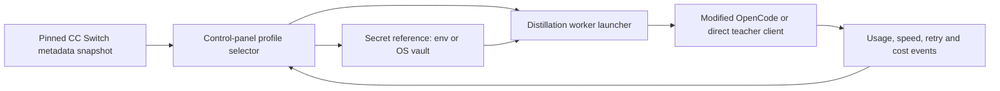

# CC Switch v3.16.5 integration decision record

[English](cc_switch_v3_16_5_integration.md) | [简体中文](cc_switch_v3_16_5_integration.zh-CN.md)

## Outcome

Use CC Switch as a design and metadata reference, not as an embedded router or a
subprocess dependency. Its OpenCode support is useful, but at v3.16.5 it is
provider injection into `opencode.json`, not a runtime request router and not a
documented public SDK.

The first integration slice is implemented as an independent metadata adapter:

- fixed at tag `v3.16.5`, annotated tag object
  `a58917a5d6d2a4ace4e7c7fd63dcee57355ef653`, commit
  `8d1b3306d09a27b9d8fc29694791d8421aba5f93`;
- reviewed, content-safe provider/model/alias/pricing JSON;
- `check`, `diff`, `apply`, and `rollback` CLI operations;
- official GitHub HTTPS allowlist, source byte limits, SHA-256, ETag cache, last
  verified fallback, strict schemas, atomic replacement, and a rollback journal;
- no upstream code execution/import, no real credential, no dashboard mutation.

The control panel should own the runtime profile and worker lifecycle. CC Switch
can remain installed independently for users who want its desktop experience, but
the panel does not need it to run.



## Version, release, and license verification

The [v3.16.5 release](https://github.com/farion1231/cc-switch/releases/tag/v3.16.5)
was published on 2026-07-01. The official GitHub
[tag reference API](https://api.github.com/repos/farion1231/cc-switch/git/ref/tags/v3.16.5)
points to annotated tag object `a58917a...`; the
[tag object API](https://api.github.com/repos/farion1231/cc-switch/git/tags/a58917a5d6d2a4ace4e7c7fd63dcee57355ef653)
points to commit `8d1b3306...`. The adapter uses commit URLs rather than mutable
`main` or a tag URL for every network trust anchor.

The pinned [root LICENSE](https://github.com/farion1231/cc-switch/blob/8d1b3306d09a27b9d8fc29694791d8421aba5f93/LICENSE)
is MIT, Copyright (c) 2025 Jason Young. The tag tree has no separate upstream
`NOTICE` file. MIT permits reuse and modification, including incorporation into
this AGPL project, provided the copyright and permission notice remains with
copied or substantial portions. This adapter includes the full text in
`src/anchor_mvp/integrations/ccswitch_metadata/NOTICE.txt` and records the notice
path in every snapshot.

Provider marks and logos are not relicensed by the MIT software license. The MVP
does not copy logos, promotional artwork, affiliate links, or partner ranking.

### Official release asset digests

These values came from the official
[GitHub release API](https://api.github.com/repos/farion1231/cc-switch/releases/tags/v3.16.5).
They are recorded for audit only; no asset was downloaded or executed.

| Asset | Bytes | SHA-256 |
| --- | ---: | --- |
| `CC-Switch-v3.16.5-Linux-arm64.AppImage` | 88881672 | `e154c98ce4813a13553d831af179a6a0890d7b52c4d890c2dc02833307892be7` |
| `CC-Switch-v3.16.5-Linux-arm64.AppImage.sig` | 424 | `8c56ec433563c091aa63e32b604b68b14dc36d69115c6b5106b1d33dee17ab3c` |
| `CC-Switch-v3.16.5-Linux-arm64.deb` | 11993434 | `e19bae7d649d90b7e1f54694c042f652fb0e35c78bbf82bdeaca2018c029f616` |
| `CC-Switch-v3.16.5-Linux-arm64.rpm` | 11995647 | `96dd5f4ad7ce9b0ea837dcd0fd7c50af38666eacd8855724379efaff1d24c6e8` |
| `CC-Switch-v3.16.5-Linux-x86_64.AppImage` | 91245048 | `0de40fd51f5df67da10d105f7bf6ed4195b4a1ba6fc9289ac11d3c306a857e49` |
| `CC-Switch-v3.16.5-Linux-x86_64.AppImage.sig` | 424 | `898138f23a4ac76fccdfe681b526f0b3dc5e517d1c399d6484428106dbbcf06e` |
| `CC-Switch-v3.16.5-Linux-x86_64.deb` | 12489082 | `ba1c935d56f3d1bf460aba614405cb6149722b785c8eac266490fbe849ff9096` |
| `CC-Switch-v3.16.5-Linux-x86_64.rpm` | 12489318 | `ee8c8a992cfa7ee62f49b49cf14f69794ff2787325cd208121ee5637017c89d3` |
| `CC-Switch-v3.16.5-macOS.dmg` | 25842794 | `1fc8b187bc7d1089eca3e9eca3a60acea5eaacb1ad9983ccf8e8fd11ec87fe3d` |
| `CC-Switch-v3.16.5-macOS.tar.gz` | 26458757 | `109153d436592fb46512fa1267657df5cf276d20d303dd413160126ce0b098d9` |
| `CC-Switch-v3.16.5-macOS.tar.gz.sig` | 408 | `b63be7f6913ddc18f2a954e22cef7de42706430a257d1c33b76d7f0e131c8bee` |
| `CC-Switch-v3.16.5-macOS.zip` | 25819382 | `55730f877479ca8c638194dff04335ed95ca38e4a5df4efbe8d9397ac0e91e4e` |
| `CC-Switch-v3.16.5-Windows-arm64-Portable.zip` | 11801593 | `402fea4ebc6539ab5acf3f0976162bda1f59b35ca9ea787afe6fbc92eb28a708` |
| `CC-Switch-v3.16.5-Windows-arm64.msi` | 11718656 | `01810d3a7bd5a4facf4f3e3332333de08f8f2150235730ee9d91608e2471dc6c` |
| `CC-Switch-v3.16.5-Windows-arm64.msi.sig` | 424 | `d5bc56bbcaaf071bdb74d21b3f6ccea8fb1e54c4686b90f0adbf09a4f5b49dfa` |
| `CC-Switch-v3.16.5-Windows-Portable.zip` | 12407588 | `bfacdd5482d917a3c363e2a56b554935b32ceb5ae4b37453e8fab09fda329498` |
| `CC-Switch-v3.16.5-Windows.msi` | 12386304 | `3a29982008bbf0419999df59ad2bdbf545c3b2bb29d87f2594f260ecacc22346` |
| `CC-Switch-v3.16.5-Windows.msi.sig` | 420 | `2d631c620b21860d074366a045fc983def3ec4af153a193803fc5781e0837c49` |
| `latest.json` | 3534 | `515259ba9c18f81fba6dc884f2fb68acaea6e9b5364474d2e121a9fedc557368` |

An asset digest does not make the desktop binary a suitable library dependency.
The pinned [Cargo manifest](https://github.com/farion1231/cc-switch/blob/8d1b3306d09a27b9d8fc29694791d8421aba5f93/src-tauri/Cargo.toml)
builds an internal Tauri library/static/dynamic crate, but the exposed operations
are Tauri IPC commands coupled to application state. There is no documented,
versioned headless SDK, local HTTP API, or provider-management CLI contract.

## What OpenCode support actually does

The exact live configuration file is resolved in
[`src-tauri/src/opencode_config.rs`](https://github.com/farion1231/cc-switch/blob/8d1b3306d09a27b9d8fc29694791d8421aba5f93/src-tauri/src/opencode_config.rs):

1. use the CC Switch `opencode_config_dir` override when configured;
2. otherwise use `~/.config/opencode`;
3. read/write `opencode.json`;
4. parse an existing file as JSON5;
5. if absent, start with `{"$schema":"https://opencode.ai/config.json"}`;
6. merge each provider under top-level `provider[provider_id]` and write JSON.

The typed shape in
[`src-tauri/src/provider.rs`](https://github.com/farion1231/cc-switch/blob/8d1b3306d09a27b9d8fc29694791d8421aba5f93/src-tauri/src/provider.rs)
is equivalent to:

```json
{
  "npm": "@ai-sdk/openai-compatible",
  "name": "Display name",
  "options": {
    "baseURL": "https://provider.example/v1",
    "apiKey": "{env:TEACHER_API_KEY}"
  },
  "models": {
    "provider-model-id": {
      "name": "Display model name",
      "limit": {"context": 200000, "output": 64000}
    }
  }
}
```

The example is a shape illustration; it contains an environment reference, not a
credential. Optional headers, model options, modalities, reasoning variants, and
flattened extension fields are also supported upstream.

The live writer in
[`src-tauri/src/services/provider/live.rs`](https://github.com/farion1231/cc-switch/blob/8d1b3306d09a27b9d8fc29694791d8421aba5f93/src-tauri/src/services/provider/live.rs)
extracts an OpenCode provider fragment, prefers the typed writer, and accepts raw
fallback only when the fragment resembles a provider (`npm` or `options`). The
provider service treats OpenCode as additive mode: several providers coexist.
Consequently CC Switch's OpenCode “switch” ensures a provider exists in live
configuration; it does not set a top-level active OpenCode model and does not
route each request at runtime.

The relevant Tauri command names include `add_provider` with `addToLive`,
`update_provider`, `delete_provider`, `remove_from_live`, `switch_provider`,
`import_opencode_providers_from_live`, and `get_opencode_live_provider_ids` in
[`src-tauri/src/commands/provider.rs`](https://github.com/farion1231/cc-switch/blob/8d1b3306d09a27b9d8fc29694791d8421aba5f93/src-tauri/src/commands/provider.rs).
They are in-process desktop IPC, not shell commands that our panel should invoke.

For this project, the exact lightweight equivalent is:

- the panel owns a provider profile with protocol, URL, model ID, concurrency,
  reconnect delay, and retry count;
- the credential field stores only an env/vault reference;
- the launcher resolves the secret into the child process at start/resume time;
- if modified OpenCode needs a config file, a dedicated adapter merges one
  namespaced provider into a project-owned config and restores the prior snapshot;
- the launcher explicitly passes the selected model. Provider injection alone is
  not presented as model switching.

No CC Switch process or command is required.

## Database and secret boundary

CC Switch v3.16.5 uses SQLite schema version 11 at
`~/.cc-switch/cc-switch.db`; see
[`src-tauri/src/database/mod.rs`](https://github.com/farion1231/cc-switch/blob/8d1b3306d09a27b9d8fc29694791d8421aba5f93/src-tauri/src/database/mod.rs).

Important tables in the pinned
[`schema.rs`](https://github.com/farion1231/cc-switch/blob/8d1b3306d09a27b9d8fc29694791d8421aba5f93/src-tauri/src/database/schema.rs):

| Table | Useful shape | Integration decision |
| --- | --- | --- |
| `providers` | `(id, app_type)` key, name, `settings_config` JSON text, category, notes/icon/meta/current/failover flags | Borrow the profile/catalog concept, not its secret persistence. |
| `proxy_config` | per Claude/Codex/Gemini listen address/port, logging, max retries, streaming/non-streaming timeouts, circuit breaker, cost multiplier, pricing-model source | Map retry/timeouts and health ideas to pipeline settings; do not import the proxy. |
| `proxy_request_logs` | request/provider/app/model/request-model/pricing-model, four token dimensions, four cost components, total, latency, TTFT, status/session/source/multiplier | Good telemetry shape for the panel's own event schema. |
| `model_pricing` | model ID/display plus input/output/cache-read/cache-creation decimal strings per million | Reuse the four-dimensional decimal contract with explicit currency and unknown. |
| `usage_daily_rollups` | date/app/provider/model/request-model/pricing-model, counts, four token dimensions, cost, latency | Good aggregation dimensions; retain request and pricing model separately. |

`settings_config` contains provider options including API keys as ordinary JSON
text. The OpenCode live file also receives a literal key unless the user supplies
an environment reference. The pinned Cargo dependencies do not provide an OS
credential-vault integration for this storage path. Therefore:

- do not read/import the CC Switch database into the web panel;
- do not copy or synchronize its backups as profile data;
- never return secret values from panel APIs, status JSON, diffs, logs, or browser
  state;
- persist an env-variable name or vault record ID, and resolve only inside the
  worker-launch boundary;
- redact authorization headers and common key formats before any error reaches
  observability storage.

## Provider, model, pricing, and usage sources

There is no stable CC Switch provider/pricing metadata API at this tag.

- OpenCode presets are TypeScript constants in
  [`src/config/opencodeProviderPresets.ts`](https://github.com/farion1231/cc-switch/blob/8d1b3306d09a27b9d8fc29694791d8421aba5f93/src/config/opencodeProviderPresets.ts).
  Updating them requires a CC Switch release.
- The application can discover models from an OpenAI-compatible `/v1/models`
  endpoint in
  [`src-tauri/src/services/model_fetch.rs`](https://github.com/farion1231/cc-switch/blob/8d1b3306d09a27b9d8fc29694791d8421aba5f93/src-tauri/src/services/model_fetch.rs).
  It accepts a models-URL override and sends bearer credentials; copying that
  behavior would create SSRF and credential-exfiltration risk.
- Pricing is a Rust tuple seed in `database/schema.rs`, inserted or repaired while
  preserving user-modified rows. It is not a separately versioned data file.
- A UI dialog can fetch `https://models.dev/api.json` on demand and import selected
  prices. That is a third-party runtime feed, not a CC Switch-owned v3.16.5
  contract, so this adapter does not fetch it.
- CC Switch usage comes from proxy logs and supported CLI session logs. The
  distillation panel should instead record teacher response usage per job, because
  that is the authoritative source for this pipeline.

The audited fixture intentionally contains a small, useful subset: first-party
DeepSeek, Kimi, Zhipu GLM, MiniMax; ModelScope, OpenRouter; and a custom
OpenAI-compatible profile. It excludes affiliate-only aggregators. Exact aliases
map request IDs to pricing IDs. Price rows record `USD`, `per_1m_tokens`, input,
output, cache-read, and cache-write. Models with no exact pinned row carry
`unknown` in all four dimensions.

CC Switch's cost calculator uses decimal arithmetic. For OpenAI-compatible/Codex
and Gemini usage, fresh input is `input - cache_read` with saturation; Anthropic
input is already fresh. Each component is divided by one million and the
multiplier is applied after summing. The adapter preserves that behavior, except
that an unknown price returns unavailable rather than CC Switch's display-level
zero fallback.

Model normalization upstream uses a broad candidate strategy: strip provider
namespaces, dates, Bedrock suffixes, reasoning-effort suffixes, and sometimes use
guarded family-prefix matching. That is convenient for analytics but can attach
the wrong price to a future model. The MVP exports exact aliases only. Any future
normalizer must output its selected pricing model and rule ID so an estimate is
auditable.

## Network and filesystem safety

The implemented metadata sync does the following:

1. validates every bundled field against a closed schema;
2. permits only seven exact `raw.githubusercontent.com` URLs containing the pinned
   commit;
3. sends no authorization header and accepts no user URL;
4. caps a response at 2 MB, checks exact expected byte length and SHA-256, then
   discards the bytes;
5. stores only ETag/hash/size/time in the verification cache;
6. treats HTTP/network unavailability as a reason to use the last verified
   snapshot;
7. treats changed bytes, redirects, oversized content, duplicate JSON keys,
   unknown schema fields, duplicate providers/models/prices/aliases, invalid price
   units, and unsafe content as hard failures;
8. writes a same-directory temporary file, fsyncs, and uses `os.replace`, with a
   short bounded Windows retry;
9. journals the prior active snapshot before apply and supports rollback;
10. emits JSON with HTML-significant characters escaped.

If upstream later publishes stable JSON, add a new adapter version that pins its
path and hash, validates this same contract, and still requires an explicit review
before changing the bundled snapshot. Do not scrape UI HTML or evaluate bundled
JavaScript to “sync” metadata.

Runtime `/models` discovery belongs to a different component. It should allow only
the selected provider's same origin (or an administrator-pinned origin), reject
loopback/private/link-local targets unless the profile is explicitly local, limit
response size/count, cache briefly, and never follow a cross-origin redirect with
credentials.

## Windows and WSL behavior

For a Windows CC Switch process, the default OpenCode config is under the Windows
user profile, typically
`C:\Users\NAME\.config\opencode\opencode.json`. Its home resolver uses the OS
profile on Windows rather than relying on an injected Unix-style `HOME`. Users can
set CC Switch's OpenCode config-directory override.

OpenCode session database resolution is separate: `OPENCODE_DB`, then
`XDG_DATA_HOME/opencode`, then `~/.local/share/opencode/opencode.db` on all
platforms, by design in `opencode_config.rs`.

A Windows desktop process does not automatically manage the WSL user's
`~/.config/opencode`. A UNC override such as
`\\wsl.localhost\DISTRO\home\USER\.config\opencode` can address it, but Windows
and Linux locking/replace behavior across that boundary is less predictable. The
recommended deployment is to run the panel/worker/config adapter inside the same
OS boundary as OpenCode. If Windows must control WSL, use a small WSL-side helper
with a narrow JSON protocol and one writer lock; never let CC Switch and the panel
mutate the same file concurrently.

## Reuse boundary and staged integration

| Area | Decision | Reason |
| --- | --- | --- |
| Provider names, first-party endpoints, exact model IDs | Reuse as attributed reviewed metadata | Useful and low coupling; no secret or executable code. |
| Four token/cost dimensions and decimal formula | Reimplement with attribution and explicit unknown/currency | Fits panel accounting but needs stricter semantics. |
| OpenCode provider JSON shape | Reimplement a namespaced merge adapter | Small stable surface; avoids Tauri coupling. |
| CC Switch Rust/TypeScript library | Do not link/import | No stable SDK and unnecessary desktop dependencies. |
| Desktop binary subprocess | Do not use | No headless control contract; hard to supervise and secure. |
| SQLite provider/secret store | Do not import | Plaintext credential exposure and schema coupling. |
| Arbitrary model-fetch URL and double-GET speed test | Do not port directly | SSRF, key exfiltration, and waste risk. |
| Request/rollup telemetry dimensions | Reimplement in pipeline events | Direct teacher usage is more complete and auditable. |

Recommended delivery order:

1. **Done: metadata foundation.** Pinned fixture, strict schema, provenance,
   verification/cache, diff/apply/rollback, decimal estimate helper, tests.
2. **Panel profiles.** URL, secret reference, protocol, model, concurrency,
   reconnect delay/max retries, start/stop/resume, and validated profile switching.
3. **Worker control.** One authoritative state machine with graceful stop,
   resumable checkpoints, bounded retries/jitter, and speed/queue/usage events.
4. **OpenCode adapter.** Optional, project-owned provider merge and model argument;
   backup/rollback and single-writer lock. Do not edit a user's global file by
   default.
5. **Accounting.** Per-job input/output/cache counts, request/pricing model,
   currency, known/unknown cost, throughput, TTFT/latency, error/retry counts, and
   daily rollups.
6. **Health and failover.** Same-origin probes, circuit breaker, explicit ordered
   fallback profiles, and no duplicate paid generation unless idempotency is
   guaranteed.

This gets the useful CC Switch experience into the web control plane while keeping
the actual distillation pipeline lightweight, reproducible, and secret-safe.
