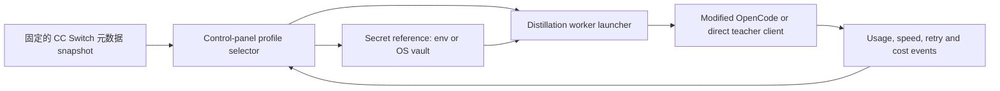

# CC Switch v3.16.5 集成决策记录

[English](cc_switch_v3_16_5_integration.md) | [简体中文](cc_switch_v3_16_5_integration.zh-CN.md)

## 结论

把 CC Switch 用作设计与元数据参考，不把它嵌入为路由器，也不把它作为子进程依赖。它对
OpenCode 的支持很有用，但在 v3.16.5 中，这种支持是向 `opencode.json` 注入 Provider，
不是运行时请求路由器，也不是已有文档的公开 SDK。

第一阶段集成已经实现为独立的元数据 adapter：

- 固定 tag `v3.16.5`、annotated tag object
  `a58917a5d6d2a4ace4e7c7fd63dcee57355ef653` 与 commit
  `8d1b3306d09a27b9d8fc29694791d8421aba5f93`；
- 已审查、content-safe 的 Provider/model/alias/pricing JSON；
- `check`、`diff`、`apply` 和 `rollback` CLI 操作；
- 官方 GitHub HTTPS allowlist、来源字节数上限、SHA-256、ETag cache、last verified
  fallback、严格 schema、原子替换和 rollback journal；
- 不执行/导入上游代码，不含真实 credential，不修改 dashboard。

Control panel 应拥有运行时 profile 与 worker 生命周期。希望使用 CC Switch 桌面体验的用户
仍可单独安装它，但 panel 的运行不依赖 CC Switch。



## 版本、release 与许可证验证

[v3.16.5 release](https://github.com/farion1231/cc-switch/releases/tag/v3.16.5)
发布于 2026-07-01。官方 GitHub
[tag reference API](https://api.github.com/repos/farion1231/cc-switch/git/ref/tags/v3.16.5)
指向 annotated tag object `a58917a...`；
[tag object API](https://api.github.com/repos/farion1231/cc-switch/git/tags/a58917a5d6d2a4ace4e7c7fd63dcee57355ef653)
指向 commit `8d1b3306...`。Adapter 对每个网络信任锚使用 commit URL，而不是可变的
`main` 或 tag URL。

固定版本的[根 LICENSE](https://github.com/farion1231/cc-switch/blob/8d1b3306d09a27b9d8fc29694791d8421aba5f93/LICENSE)
是 MIT，Copyright (c) 2025 Jason Young。该 tag 的文件树没有单独的上游 `NOTICE` 文件。
MIT 允许复用和修改，包括并入本 AGPL 项目，但复制的文件或实质性部分必须保留版权与许可声明。
本 adapter 在 `src/anchor_mvp/integrations/ccswitch_metadata/NOTICE.txt` 中包含完整文本，并在
每个 snapshot 中记录 notice 路径。

Provider 商标与 logo 不会因 MIT 软件许可证而被重新许可。MVP 不复制 logo、宣传图片、
affiliate link 或合作伙伴排名。

### 官方 release asset digest

这些值来自官方
[GitHub release API](https://api.github.com/repos/farion1231/cc-switch/releases/tags/v3.16.5)。
它们只用于审计；没有下载或执行任何 asset。

| Asset | Bytes | SHA-256 |
| --- | ---: | --- |
| `CC-Switch-v3.16.5-Linux-arm64.AppImage` | 88881672 | `e154c98ce4813a13553d831af179a6a0890d7b52c4d890c2dc02833307892be7` |
| `CC-Switch-v3.16.5-Linux-arm64.AppImage.sig` | 424 | `8c56ec433563c091aa63e32b604b68b14dc36d69115c6b5106b1d33dee17ab3c` |
| `CC-Switch-v3.16.5-Linux-arm64.deb` | 11993434 | `e19bae7d649d90b7e1f54694c042f652fb0e35c78bbf82bdeaca2018c029f616` |
| `CC-Switch-v3.16.5-Linux-arm64.rpm` | 11995647 | `96dd5f4ad7ce9b0ea837dcd0fd7c50af38666eacd8855724379efaff1d24c6e8` |
| `CC-Switch-v3.16.5-Linux-x86_64.AppImage` | 91245048 | `0de40fd51f5df67da10d105f7bf6ed4195b4a1ba6fc9289ac11d3c306a857e49` |
| `CC-Switch-v3.16.5-Linux-x86_64.AppImage.sig` | 424 | `898138f23a4ac76fccdfe681b526f0b3dc5e517d1c399d6484428106dbbcf06e` |
| `CC-Switch-v3.16.5-Linux-x86_64.deb` | 12489082 | `ba1c935d56f3d1bf460aba614405cb6149722b785c8eac266490fbe849ff9096` |
| `CC-Switch-v3.16.5-Linux-x86_64.rpm` | 12489318 | `ee8c8a992cfa7ee62f49b49cf14f69794ff2787325cd208121ee5637017c89d3` |
| `CC-Switch-v3.16.5-macOS.dmg` | 25842794 | `1fc8b187bc7d1089eca3e9eca3a60acea5eaacb1ad9983ccf8e8fd11ec87fe3d` |
| `CC-Switch-v3.16.5-macOS.tar.gz` | 26458757 | `109153d436592fb46512fa1267657df5cf276d20d303dd413160126ce0b098d9` |
| `CC-Switch-v3.16.5-macOS.tar.gz.sig` | 408 | `b63be7f6913ddc18f2a954e22cef7de42706430a257d1c33b76d7f0e131c8bee` |
| `CC-Switch-v3.16.5-macOS.zip` | 25819382 | `55730f877479ca8c638194dff04335ed95ca38e4a5df4efbe8d9397ac0e91e4e` |
| `CC-Switch-v3.16.5-Windows-arm64-Portable.zip` | 11801593 | `402fea4ebc6539ab5acf3f0976162bda1f59b35ca9ea787afe6fbc92eb28a708` |
| `CC-Switch-v3.16.5-Windows-arm64.msi` | 11718656 | `01810d3a7bd5a4facf4f3e3332333de08f8f2150235730ee9d91608e2471dc6c` |
| `CC-Switch-v3.16.5-Windows-arm64.msi.sig` | 424 | `d5bc56bbcaaf071bdb74d21b3f6ccea8fb1e54c4686b90f0adbf09a4f5b49dfa` |
| `CC-Switch-v3.16.5-Windows-Portable.zip` | 12407588 | `bfacdd5482d917a3c363e2a56b554935b32ceb5ae4b37453e8fab09fda329498` |
| `CC-Switch-v3.16.5-Windows.msi` | 12386304 | `3a29982008bbf0419999df59ad2bdbf545c3b2bb29d87f2594f260ecacc22346` |
| `CC-Switch-v3.16.5-Windows.msi.sig` | 420 | `2d631c620b21860d074366a045fc983def3ec4af153a193803fc5781e0837c49` |
| `latest.json` | 3534 | `515259ba9c18f81fba6dc884f2fb68acaea6e9b5364474d2e121a9fedc557368` |

Asset digest 不会让桌面二进制变成合适的库依赖。固定版本的
[Cargo manifest](https://github.com/farion1231/cc-switch/blob/8d1b3306d09a27b9d8fc29694791d8421aba5f93/src-tauri/Cargo.toml)
会构建内部 Tauri library/static/dynamic crate，但暴露的操作是与应用状态耦合的 Tauri IPC
command。它没有文档化、版本化的 headless SDK、本地 HTTP API 或 Provider 管理 CLI 合同。

## OpenCode 支持实际做了什么

准确的 live 配置文件解析逻辑位于
[`src-tauri/src/opencode_config.rs`](https://github.com/farion1231/cc-switch/blob/8d1b3306d09a27b9d8fc29694791d8421aba5f93/src-tauri/src/opencode_config.rs)：

1. 配置了 CC Switch `opencode_config_dir` override 时使用它；
2. 否则使用 `~/.config/opencode`；
3. 读写 `opencode.json`；
4. 将已有文件解析为 JSON5；
5. 文件不存在时从 `{"$schema":"https://opencode.ai/config.json"}` 开始；
6. 把每个 Provider 合并到顶层 `provider[provider_id]` 并写回 JSON。

[`src-tauri/src/provider.rs`](https://github.com/farion1231/cc-switch/blob/8d1b3306d09a27b9d8fc29694791d8421aba5f93/src-tauri/src/provider.rs)
中的类型化结构等价于：

```json
{
  "npm": "@ai-sdk/openai-compatible",
  "name": "Display name",
  "options": {
    "baseURL": "https://provider.example/v1",
    "apiKey": "{env:TEACHER_API_KEY}"
  },
  "models": {
    "provider-model-id": {
      "name": "Display model name",
      "limit": {"context": 200000, "output": 64000}
    }
  }
}
```

此例仅用于说明结构；它包含环境变量引用，不包含 credential。上游还支持可选 header、model
option、modality、reasoning variant 与扁平化 extension field。

[`src-tauri/src/services/provider/live.rs`](https://github.com/farion1231/cc-switch/blob/8d1b3306d09a27b9d8fc29694791d8421aba5f93/src-tauri/src/services/provider/live.rs)
中的 live writer 会提取 OpenCode Provider fragment，优先使用类型化 writer，并且只有 fragment
类似 Provider（含 `npm` 或 `options`）时才接受 raw fallback。Provider service 把 OpenCode
视为 additive mode：多个 Provider 可以共存。因此，CC Switch 的 OpenCode “switch” 只保证
live 配置中存在该 Provider；它不会设置顶层 active OpenCode model，也不会在运行时路由每个请求。

相关 Tauri command 名称包括 `add_provider`（带 `addToLive`）、`update_provider`、
`delete_provider`、`remove_from_live`、`switch_provider`、
`import_opencode_providers_from_live` 和 `get_opencode_live_provider_ids`，见
[`src-tauri/src/commands/provider.rs`](https://github.com/farion1231/cc-switch/blob/8d1b3306d09a27b9d8fc29694791d8421aba5f93/src-tauri/src/commands/provider.rs)。
这些是进程内桌面 IPC，不是 panel 应调用的 shell command。

对本项目而言，准确的轻量等价实现是：

- panel 拥有包含 protocol、URL、model ID、concurrency、reconnect delay 和 retry count 的
  Provider profile；
- credential 字段只存 env/vault reference；
- launcher 在 start/resume 时把 secret 解析到 child process；
- 如果 modified OpenCode 需要配置文件，专用 adapter 会把一个 namespaced Provider 合并到
  项目自有配置，并恢复此前 snapshot；
- launcher 显式传入选定模型。不能把只注入 Provider 描述成切换模型。

不需要任何 CC Switch process 或 command。

## 数据库与 secret 边界

CC Switch v3.16.5 在 `~/.cc-switch/cc-switch.db` 使用 SQLite schema version 11；见
[`src-tauri/src/database/mod.rs`](https://github.com/farion1231/cc-switch/blob/8d1b3306d09a27b9d8fc29694791d8421aba5f93/src-tauri/src/database/mod.rs)。

固定版本
[`schema.rs`](https://github.com/farion1231/cc-switch/blob/8d1b3306d09a27b9d8fc29694791d8421aba5f93/src-tauri/src/database/schema.rs)
中的重要表：

| 表 | 可用结构 | 集成决策 |
| --- | --- | --- |
| `providers` | `(id, app_type)` key、name、`settings_config` JSON text、category、notes/icon/meta/current/failover flags | 借鉴 profile/catalog 概念，不借鉴其 secret 持久化。 |
| `proxy_config` | Claude/Codex/Gemini 各自的 listen address/port、logging、max retries、streaming/non-streaming timeout、circuit breaker、cost multiplier、pricing-model source | 把 retry/timeout 与 health 思路映射到 pipeline 设置；不导入 proxy。 |
| `proxy_request_logs` | request/provider/app/model/request-model/pricing-model、四个 token 维度、四个 cost 组成、total、latency、TTFT、status/session/source/multiplier | 适合作为 panel 自有 event schema 的 telemetry 结构。 |
| `model_pricing` | model ID/display，加上每百万 token 的 input/output/cache-read/cache-creation decimal string | 复用四维 decimal 合同，但显式标注 currency 与 unknown。 |
| `usage_daily_rollups` | date/app/provider/model/request-model/pricing-model、count、四个 token 维度、cost、latency | 是良好的聚合维度；分别保留 request model 和 pricing model。 |

`settings_config` 把包括 API key 在内的 Provider option 存为普通 JSON text。除非用户提供环境
引用，OpenCode live 文件也会收到字面 key。固定 Cargo dependency 没有为此存储路径提供 OS
credential-vault 集成。因此：

- 不把 CC Switch 数据库读入/导入 web panel；
- 不复制或同步它的 backup 作为 profile 数据；
- panel API、status JSON、diff、log 或 browser state 绝不返回 secret value；
- 持久化环境变量名或 vault record ID，只在 worker-launch 边界内解析；
- 任何错误进入 observability storage 之前，都要脱敏 authorization header 和常见 key 格式。

## Provider、model、pricing 与 usage 来源

该 tag 没有稳定的 CC Switch Provider/pricing 元数据 API。

- OpenCode preset 是
  [`src/config/opencodeProviderPresets.ts`](https://github.com/farion1231/cc-switch/blob/8d1b3306d09a27b9d8fc29694791d8421aba5f93/src/config/opencodeProviderPresets.ts)
  中的 TypeScript constant。更新它们需要新的 CC Switch release。
- 应用可以通过
  [`src-tauri/src/services/model_fetch.rs`](https://github.com/farion1231/cc-switch/blob/8d1b3306d09a27b9d8fc29694791d8421aba5f93/src-tauri/src/services/model_fetch.rs)
  从 OpenAI-compatible `/v1/models` endpoint 发现模型。它接受 models-URL override 并发送
  bearer credential；复制这种行为会带来 SSRF 与 credential-exfiltration 风险。
- Pricing 是 `database/schema.rs` 中的 Rust tuple seed，插入或修复时会保留用户修改过的行。
  它不是单独版本化的数据文件。
- UI dialog 可以按需获取 `https://models.dev/api.json` 并导入选中价格。这是第三方运行时 feed，
  不是 CC Switch 自有的 v3.16.5 合同，因此本 adapter 不获取它。
- CC Switch usage 来自 proxy log 与受支持的 CLI session log。Distillation panel 应记录每个
  job 的 teacher response usage，因为它才是本 pipeline 的权威来源。

已审计 fixture 有意只保留一小组有用来源：第一方 DeepSeek、Kimi、Zhipu GLM、MiniMax；
ModelScope、OpenRouter；以及一个自定义 OpenAI-compatible profile。它排除了只通过 affiliate
提供的 aggregator。精确 alias 把 request ID 映射到 pricing ID。价格行记录 `USD`、
`per_1m_tokens`、input、output、cache-read 和 cache-write。没有固定精确价格行的模型在四个
维度均标记 `unknown`。

CC Switch 的 cost calculator 使用 decimal arithmetic。对 OpenAI-compatible/Codex 和 Gemini
usage，fresh input 是饱和减法 `input - cache_read`；Anthropic input 已经是 fresh。每个组成项
除以一百万，求和后再应用 multiplier。Adapter 保留这种行为，但 unknown price 会返回
unavailable，而不是使用 CC Switch 的显示层 zero fallback。

上游 model normalization 使用宽泛候选策略：去除 Provider namespace、date、Bedrock suffix、
reasoning-effort suffix，有时还使用带 guard 的 family-prefix matching。这对分析很方便，但可能
给未来模型附上错误价格。MVP 只导出精确 alias。任何未来 normalizer 都必须输出选中的 pricing
model 与 rule ID，使估算可审计。

## 网络与文件系统安全

已实现的元数据同步会：

1. 依据闭合 schema 校验每个 bundled field；
2. 只允许七个精确的 `raw.githubusercontent.com` URL，且都包含固定 commit；
3. 不发送 authorization header，也不接受用户 URL；
4. 把响应限制在 2 MB，检查精确预期字节数与 SHA-256 后丢弃字节；
5. verification cache 只存 ETag/hash/size/time；
6. HTTP/网络不可用时使用 last verified snapshot；
7. changed byte、redirect、超大内容、重复 JSON key、未知 schema field、重复
   Provider/model/price/alias、无效价格单位与 unsafe content 均为 hard failure；
8. 在同一目录写 temporary file，`fsync` 后使用 `os.replace`，Windows 只做短时有界重试；
9. apply 前把此前 active snapshot 写入 journal，并支持 rollback；
10. 输出 JSON 时转义 HTML-significant character。

如果上游以后发布稳定 JSON，应新增一个 adapter version：固定 path 与 hash，仍校验相同合同，
并且变更 bundled snapshot 前仍要求显式审查。不要抓取 UI HTML，也不要执行 bundled JavaScript
来“同步”元数据。

运行时 `/models` discovery 属于另一个组件。它应只允许选中 Provider 的 same origin（或管理员
固定的 origin）；除非 profile 明确是 local，否则拒绝 loopback/private/link-local 目标；限制
响应大小与数量并短暂缓存；绝不携带 credential 跟随 cross-origin redirect。

## Windows 与 WSL 行为

Windows CC Switch process 的默认 OpenCode 配置位于 Windows 用户 profile，例如
`C:\Users\NAME\.config\opencode\opencode.json`。它在 Windows 上使用 OS profile 解析 home，
不依赖注入的 Unix 风格 `HOME`。用户可以设置 CC Switch OpenCode config-directory override。

OpenCode session database 另行解析：依次为 `OPENCODE_DB`、`XDG_DATA_HOME/opencode`、
`~/.local/share/opencode/opencode.db`；这是 `opencode_config.rs` 为所有平台设计的行为。

Windows 桌面进程不会自动管理 WSL 用户的 `~/.config/opencode`。类似
`\\wsl.localhost\DISTRO\home\USER\.config\opencode` 的 UNC override 可以访问它，但跨越该
边界的 Windows/Linux locking/replace 行为不够可预测。推荐让 panel/worker/config adapter 与
OpenCode 运行在同一个 OS 边界内。如果 Windows 必须控制 WSL，应使用具有窄 JSON protocol
和单 writer lock 的小型 WSL-side helper；绝不能让 CC Switch 与 panel 并发修改同一文件。

## 复用边界与分阶段集成

| 范围 | 决策 | 原因 |
| --- | --- | --- |
| Provider name、第一方 endpoint、精确 model ID | 作为有署名且已审查的元数据复用 | 有用且耦合低；不含 secret 或 executable code。 |
| 四个 token/cost 维度和 decimal formula | 重新实现并署名，显式区分 unknown/currency | 适合 panel 计费，但需要更严格语义。 |
| OpenCode Provider JSON 结构 | 重新实现 namespaced merge adapter | 接口小且稳定；避免 Tauri 耦合。 |
| CC Switch Rust/TypeScript library | 不 link/import | 没有稳定 SDK，而且无需桌面依赖。 |
| 桌面二进制子进程 | 不使用 | 没有 headless control 合同，难以监督和保护。 |
| SQLite Provider/secret store | 不导入 | 存在明文 credential 暴露与 schema 耦合。 |
| 任意 model-fetch URL 和 double-GET speed test | 不直接移植 | 存在 SSRF、key 泄漏与额度浪费风险。 |
| Request/rollup telemetry 维度 | 在 pipeline event 中重新实现 | 直接 teacher usage 更完整且可审计。 |

推荐交付顺序：

1. **已完成：元数据基础。** 固定 fixture、严格 schema、provenance、verification/cache、
   diff/apply/rollback、decimal estimate helper 与测试。
2. **Panel profile。** URL、secret reference、protocol、model、concurrency、reconnect delay/
   max retries、start/stop/resume，以及通过校验的 profile switching。
3. **Worker control。** 唯一权威 state machine，包含 graceful stop、可恢复 checkpoint、
   有界 retry/jitter，以及 speed/queue/usage event。
4. **OpenCode adapter。** 可选的项目自有 Provider merge 与 model argument；backup/rollback
   和 single-writer lock。默认不修改用户全局文件。
5. **计费。** 每 job input/output/cache count、request/pricing model、currency、known/unknown
   cost、throughput、TTFT/latency、error/retry count 与 daily rollup。
6. **健康与 failover。** Same-origin probe、circuit breaker、显式有序 fallback profile；除非
   能保证 idempotency，否则不产生重复付费 generation。

这样可以把 CC Switch 中有用的体验带入 web control plane，同时让实际蒸馏 pipeline 保持
轻量、可复现且不会泄露 secret。
