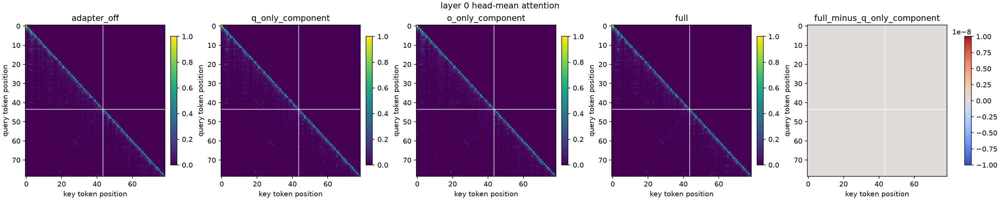
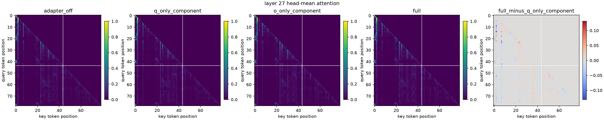

# Qwen Q+O Attention-Weight Hook v1

## Purpose

This independent diagnostic asks a narrow question about the controlled
Q+O proxy adapter: how do selected head-mean attention matrices change when
the Q and O LoRA components are viewed separately? It does not train, mutate,
merge, or republish an adapter.

The audit installs forward hooks on eager-attention modules at decoder layers
0, 13, and 27. One inline synthetic probe is evaluated in four reversible
PEFT modes:

1. `adapter_off`
2. `q_only_component` (`o_proj` LoRA scaling is temporarily zero)
3. `o_only_component` (`q_proj` LoRA scaling is temporarily zero)
4. `full`

Each layer is rendered as one five-panel image: the four absolute attention
matrices plus `full - q_only_component`. Panels expose only query/key token
positions and the prompt/target boundary. They never expose prompt text,
target text, or raw token IDs.

## Output contract

The output directory contains exactly:

- `summary.json`
- mandatory `summary.json.sha256`
- `layer_00_attention.png`
- `layer_13_attention.png`
- `layer_27_attention.png`

The summary authenticates each head-mean float32 attention matrix, records
target-query prompt-attention mass and entropy, and reports mode-difference
norms. Publication is atomic and refuses to replace an existing result.

## Interpretation boundary

Attention weights are a diagnostic proxy, not an explanation and not a
causal attribution. A visible difference cannot prove better routing,
generalization, memory, or task quality. This audit is also a one-probe
controlled diagnostic, not formal evaluation. All corresponding claims remain
false in the machine-readable receipt.

Component views are implemented by temporarily changing the PEFT `scaling`
maps and restoring every original value in a `finally` block. The base and
adapter files are authenticated before model loading and are not changed.

## Reproduced local run

The frozen Qwen2.5-1.5B snapshot and step-80 Q+O adapter were evaluated on an
RTX 3080 Ti with one 79-token probe (44 prompt tokens and 35 target tokens).
The complete four-mode run, including model loading and PNG rendering, took
about 39 seconds.

The same-layer boundary behaved exactly as the attention equation predicts:
at layer 0, `o_only_component == adapter_off` and
`full == q_only_component`. `O_proj` is downstream of the current layer's
softmax, so it cannot change that layer's attention weights. Its effect becomes
visible after residual-stream propagation: `full - q_only_component` had
mean/max absolute differences of `0.000826 / 0.0615` at layer 13 and
`0.001908 / 0.1310` at layer 27. At layer 27, target-query attention mass on
prompt positions changed from `0.7467` (Q-only) to `0.7253` (full).

These observations diagnose an indirect downstream effect of O; they do not
prove memorization. The authenticated summary is in
[`results/qwen_attention_weight_hook_qpluso_v1_summary.json`](results/qwen_attention_weight_hook_qpluso_v1_summary.json).






To reproduce the run with the frozen local model snapshot:

```powershell
$env:PYTHONPATH = "src"
python scripts/research/run_qwen_attention_weight_hook.py --execute
```

The runner enforces local-files-only mode, eager attention, BF16 weights,
TF32 matrix multiplication, batch size one, no cache, one synthetic probe,
zero network requests, zero held-out reads, and zero protected-body reads.

Configuration: `configs/research/qwen_attention_weight_hook_v1.yaml`.
