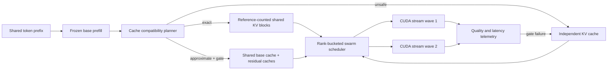

# RFC: Neural Swarm — quality-gated multi-LoRA cache sharing

Status: research draft 0.1
Branch: `research/neural-swarm-kv`
Claim scope: architecture and prototype only; no throughput or quality claim yet

## Abstract

Neural Swarm explores a task-to-token adapter mixture on one frozen base model.
Its first milestone is branch-level multi-LoRA serving over long shared prefixes.
It combines three ideas that must remain separate in both code and reporting:

1. adapter routing chooses which low-rank residuals execute;
2. cache sharing chooses which prefix states may be reused;
3. CUDA scheduling chooses when independent residual kernels run.

The project does **not** treat those three optimizations as equivalent. Selecting
an adapter can be an O(1) metadata operation, but adapter computation, residual
cache creation, attention reconstruction, synchronization, and inter-GPU traffic
are not zero-cost.

## Corrections to the motivating draft

| Draft statement | Research-safe statement |
| --- | --- |
| One base forward creates a globally exact KV cache for arbitrary LoRAs. | Different adapters generally create different hidden states and therefore different K/V. Exact reuse has a layer frontier. |
| Base KV plus LoRA residual is lossless at every layer. | The algebra is exact for a fixed input `x`; sharing the same base component after adapter-specific `x` diverges is approximate. |
| Independent LoRA queries are equivalent to native attention heads. | They are separate low-rank residual branches. Equivalence requires a defined gate, normalization, and joint training objective. |
| CUDA streams make all experts execute in parallel for free. | Streams expose concurrency. Speedup depends on occupancy, memory bandwidth, kernel size, rank skew, and synchronization overhead. |
| Two 24 GB NVLink GPUs are one flat 48 GB VRAM pool. | Allocations remain device-owned. Tensor/cache placement and peer access must be explicit even when NVLink is available. |
| SFT alone makes each expert ignore irrelevant context. | This is a hypothesis. It requires negative examples, routing labels, attention/quality probes, and an isolated-KV control. |

## Relationship to prior work

- [ForkKV](https://arxiv.org/abs/2604.06370) decomposes K/V projection state into
  a shared base cache and an adapter residual cache, manages branches with a
  DualRadixTree, and reconstructs attention with a fused kernel. The paper
  explicitly states that sharing the base cache beyond the first layer is
  mathematically lossy because adapter hidden states diverge. Its reported
  quality results are empirical, not an exactness proof.
- [S-LoRA](https://arxiv.org/abs/2311.03285) provides unified paging for adapter
  weights and KV cache plus heterogeneous batching kernels.
- [Punica](https://arxiv.org/abs/2310.18547) provides multi-tenant LoRA batching
  kernels and scheduling over one shared base model.
- Dynamic and token-level adapter mixtures already have several precedents,
  including X-LoRA, MeteoRA, MoLE, and Mixture-of-LoRAs. Neural Swarm therefore
  does not claim that “LoRA as experts” is new by itself.

The research opportunity is the joint controller: an exactness-aware cache plan,
quality-gated approximate mode, task-to-token routing evolution, heterogeneous
rank allocation, and consumer multi-GPU scheduling under one matched benchmark.

## Correctness model

For layer `l`, let `h_l` be the input hidden state and let a LoRA projection be

`y_l = h_l W_l + h_l A_i B_i`.

The decomposition is exact when both terms use the same `h_l`. Once an adapter
changes a residual stream, later layers receive adapter-specific `h_l`. Reusing
another branch's `h_l W_l` is then an approximation.

The reference planner implements these conservative rules:

- K/V LoRA at layer `l`: exact shared K/V ends before `l`.
- Q/O/MLP LoRA at layer `l`: K/V at `l` is still shareable, but downstream K/V
  starts diverging at `l + 1`.
- An adapter inactive during common-prefix prefill may reuse the full prefix.
- Approximate disaggregation is always labelled lossy and always requires a
  quality gate against isolated KV.

The implementation is in
[`src/anchor_mvp/research/neural_swarm.py`](../../src/anchor_mvp/research/neural_swarm.py).

## Proposed execution architecture



### Why rank-bucketed waves

A global barrier across rank-8 and rank-128 experts makes the small expert wait
for the large one. Neural Swarm groups requests by estimated `rank × tokens`
and uses one barrier per wave. Continuous batching remains the preferred end
state; barriers are an experiment variable, not a permanent design requirement.

### Task-to-token evolution

1. **Branch routing (MVP):** one adapter per agent branch. This aligns with the
   existing five-stage pipeline and keeps cache ownership testable.
2. **Layer routing:** selected adapter families may be active only in specific
   decoder layers, extending the exact cache frontier.
3. **Token routing:** a learned gate selects Top-k LoRA residuals per token.
   This becomes Adapter-MoE and requires gate training plus capacity/load balance.

Cache sharing does not itself provide token routing. Token routing also changes
the cache identity: the cache key must include the gate/version and the complete
routing history that can affect hidden states.

The training-side M0 for role-specific Query views is specified separately in
[`neural_swarm_query_specialization.md`](neural_swarm_query_specialization.md).
It defines the task-board JSON handoff, Q-only/Q+O controls, paired distractor
curriculum, split-safe CPU signal probe, and later causal gates without changing
the canonical five-stage Gold records.

The ID-decoupled, shared-input, concurrent event-plane scaffold is specified in
[`neural_swarm_multistream_pipeline.md`](neural_swarm_multistream_pipeline.md).
That contract intentionally defines no evaluation groups and makes no CUDA/KV
parallel-speedup claim.

## MVP implementation plan

### M0 — planning model (implemented)

- exact layer-frontier classifier;
- approximate-mode label and fallback contract;
- KV-memory estimator;
- rank-bucketed wave planner;
- offline unit tests.

### M1 — CUDA stream microbenchmark (implemented as a probe)

Run:

```powershell
python scripts/research/benchmark_cuda_streams.py `
  --hidden-size 2048 --token-count 128 --ranks 8,16,32,64
```

The JSON result compares a serial residual path with tick/tock CUDA streams. It
does not include attention or inter-GPU traffic and cannot establish end-to-end
speedup.

The first RTX 3080 Ti probe did **not** promote stream overlap: four tested
configurations produced median speedups from `0.69x` to `0.81x`, meaning the
streamed path was slower. The content-free result is retained in
[`artifacts/research/neural_swarm/cuda_stream_probe_20260720.json`](../../artifacts/research/neural_swarm/cuda_stream_probe_20260720.json).
The follow-up rank-grouped PyTorch batched-GEMM probe produced `1.11x` for the
heterogeneous rank set and `2.32x`/`1.42x` for homogeneous rank-16 sets. Its
result is retained in
[`artifacts/research/neural_swarm/cuda_rank_grouped_probe_20260720.json`](../../artifacts/research/neural_swarm/cuda_rank_grouped_probe_20260720.json).
This promotes a grouped/fused heterogeneous-LoRA kernel to the next probe, not
more global barriers.

### M2 — exact serving prototype

- hook a supported decoder attention module;
- share only cache blocks before the computed exact frontier;
- use independent suffix caches;
- compare logits bitwise/tolerance-wise with fully isolated inference;
- add refcounts and copy-on-write block ownership.

### M3 — approximate disaggregated cache

- retain `xA` residuals for K/V targets;
- reconstruct base plus residual inside a Triton attention kernel;
- record hidden-state cosine, next-token KL, task pass rate, TTFT, tokens/s,
  peak VRAM, and P50/P95 latency;
- immediately fall back to isolated KV if a calibrated gate fails.

### M4 — two-GPU topology

- measure peer-access and P2P bandwidth first;
- pin each KV block to an owning device;
- compare tensor-parallel, pipeline-parallel, and cache-owner placement;
- never report 48 GB as flat unified VRAM.

## Experimental matrix

| Arm | Routing | KV policy | Scheduler | Purpose |
| --- | --- | --- | --- | --- |
| G0 | branch | independent | serial | exact reference |
| G1 | branch | exact layer frontier | serial | isolate cache benefit |
| G2 | branch | exact layer frontier | rank-bucket streams | isolate scheduling benefit |
| G3 | branch | approximate disaggregated | rank-bucket streams | ForkKV-like quality/performance tradeoff |
| G4 | token Top-k | quality-gated hybrid | continuous batching | future Adapter-MoE target |

All arms must share base weights, quantization, prompts, seeds, generation
settings, adapter weights, and hardware placement. G3/G4 must report quality
deltas against G0; speed without that control is not a valid result.

## Promotion gates

1. Unit tests prove cache-frontier classification and memory formulas.
2. CUDA probe records an actual overlap benefit on the target GPU; otherwise
   streams remain disabled.
3. Exact prototype matches isolated logits.
4. Approximate mode passes a declared quality budget on held-out tasks.
5. Two-GPU mode proves placement and P2P behavior instead of assuming a unified
   allocator.

## Attribution

This research draft was developed with coding and architecture assistance from
OpenAI GPT-5.6-sol. Prior work is cited for problem framing and comparison; no
upstream result is presented as an Anchor-MoE-LoRA result.
