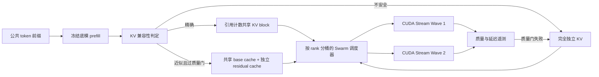

# RFC：Neural Swarm——带质量门控的多 LoRA KV 共享

状态：研究草案 0.1
分支：`research/neural-swarm-kv`
声明边界：目前只有架构和原型，不声称已经获得吞吐或质量提升

## 摘要

Neural Swarm 研究在同一个冻结底模上构建“任务级逐步演进到 token 级”的
Adapter-MoE。第一阶段先解决多个 LoRA 分支如何低成本继承同一段长前缀。

必须把三件事分开：

1. LoRA 路由决定执行哪个低秩残差；
2. KV 策略决定哪些前缀缓存允许复用；
3. CUDA 调度决定不同残差核何时运行。

切换 adapter 的元数据操作可以是 O(1)，但 LoRA 计算、残差缓存生成、注意力
重建、同步和跨卡传输都不是零成本。

## 对原始构想的校正

| 原始说法 | 可验证的工程表述 |
| --- | --- |
| 底模跑一次即可让任意 LoRA 精确共享全层 KV。 | 不同 LoRA 会改变隐藏状态和后续 K/V；精确共享只到某个层前沿。 |
| base KV 加 LoRA residual 在所有层都无损。 | 固定同一个 `x` 时代数分解精确；不同 adapter 的 `x` 已分叉后继续共享 base 部分属于近似。 |
| 独立 LoRA Query 等价于原生注意力头。 | 它只是低秩残差分支；需要明确门控、归一化和联合训练目标才可能形成 token 级专家。 |
| 多个 CUDA Stream 能零成本并发。 | 是否加速取决于占用率、带宽、kernel 尺寸、rank 偏斜和同步开销，必须实测。 |
| 两张 24 GB NVLink 卡就是平坦的 48 GB 显存。 | 显存仍由各设备分别拥有；框架必须显式切分张量、缓存和 P2P 访问。 |
| 只做 SFT，专家自然就只看相关上下文。 | 这是待验证假设，需要负样本、路由标签、注意力/质量探针和独立 KV 对照。 |

## 与已有工作的关系

- [ForkKV](https://arxiv.org/abs/2604.06370) 已提出 base cache、LoRA residual
  cache、DualRadixTree 和融合式 ResidualAttention。论文明确承认：不同 adapter
  的隐藏状态在第一层之后会分叉，因此继续共享 base cache 在数学上是有损近似。
  它报告的质量损失是实验结果，不是无损证明。
- [S-LoRA](https://arxiv.org/abs/2311.03285) 已实现 adapter/KV 统一分页和异构批处理。
- [Punica](https://arxiv.org/abs/2310.18547) 已实现共享底模上的多租户 LoRA kernel
  与调度。
- X-LoRA、MeteoRA、MoLE、Mixture-of-LoRAs 等已经覆盖动态、层级或 token 级
  多 LoRA 组合。因此“LoRA 当专家”本身不能作为新颖性主张。

本方向真正可能形成贡献的是：把精确性判定、近似质量门控、任务到 token 的
路由演进、异构 rank 分配和消费级多卡调度放进同一套可控实验中。

## 数学正确性边界

第 `l` 层输入为 `h_l`，LoRA 投影为：

`y_l = h_l W_l + h_l A_i B_i`

两个加数使用同一个 `h_l` 时，分解是精确的。一旦 adapter 改变了残差流，后续
层收到的 `h_l` 就具有 adapter 特异性；此时复用另一个分支的 `h_l W_l` 是近似。

当前参考判定器采用保守规则：

- 第 `l` 层 K/V LoRA：精确共享只能到 `l` 之前；
- 第 `l` 层 Q/O/MLP LoRA：本层 K/V 仍可共享，但从 `l + 1` 层开始分叉；
- 若 adapter 在公共前缀 prefill 阶段不激活，可精确复用整段前缀；
- 近似 disaggregated 模式永远标注为有损，并强制与独立 KV 做质量门控。

实现位于
[`src/anchor_mvp/research/neural_swarm.py`](../../src/anchor_mvp/research/neural_swarm.py)。

## 架构



### 为什么不是所有专家共用一个全局 Barrier

rank-8 专家与 rank-128 专家放在同一个屏障，会让小专家长期空等。第一版按
`rank × token 数` 分桶，每个 wave 只设一个边界。最终目标仍应是 continuous
batching；Barrier 是实验变量，不是永远固定的架构。

### 从任务级走向 token 级

1. **分支级 MVP：** 每个 agent 分支选择一个 LoRA，最容易验证缓存所有权。
2. **层级路由：** 只在指定 decoder 层激活某类 LoRA，以扩大精确共享前沿。
3. **token 级路由：** 门控器为每个 token 选择 Top-k LoRA，并对多个 `ΔW_i x`
   加权；这一步才是真正的 Adapter-MoE，需要门控训练、容量限制与负载均衡。

KV 共享不会自动产生 token 路由。反过来，token 路由历史会改变隐藏状态，因此
缓存键必须包含 gate 版本以及所有可能影响状态的路由历史。

角色专属 Query 视角的训练侧 M0 单独记录在
[`neural_swarm_query_specialization.zh-CN.md`](neural_swarm_query_specialization.zh-CN.md)。
它定义任务板 JSON 交接、Q-only/Q+O 对照、成对干扰课程、CPU 可学习性探针和
后续因果门槛，同时不改动规范的五阶段 Gold 记录。

模型 ID 解耦、共享输入与并发事件面的执行脚手架单独记录在
[`neural_swarm_multistream_pipeline.zh-CN.md`](neural_swarm_multistream_pipeline.zh-CN.md)。
该契约刻意不定义评测组，也不声称已经获得 CUDA/KV 并行加速。

## 已落地的 M0/M1

- 精确共享层前沿判定；
- 强制标记近似模式和回退要求；
- KV 显存估算；
- 按 rank 分桶的 wave 规划；
- 离线单元测试；
- `torch.cuda.Stream` + `torch.cuda.Event` tick/tock 微基准。

运行微基准：

```powershell
python scripts/research/benchmark_cuda_streams.py `
  --hidden-size 2048 --token-count 128 --ranks 8,16,32,64
```

其输出只证明特定矩阵尺寸下是否存在 stream overlap，不代表完整 attention、KV
重建、跨卡或端到端 Agent 流水线性能。

首次 RTX 3080 Ti 实测没有通过 Stream 晋级门：四组配置的中位速度比只有
`0.69x` 到 `0.81x`，即多 Stream 反而更慢。无正文结果保存在
[`artifacts/research/neural_swarm/cuda_stream_probe_20260720.json`](../../artifacts/research/neural_swarm/cuda_stream_probe_20260720.json)。
后续用 PyTorch batched GEMM 做 rank 分组后，异构 rank 获得约 `1.11x`，两组
同构 rank-16 分别获得约 `2.32x` 和 `1.42x`。结果保存在
[`artifacts/research/neural_swarm/cuda_rank_grouped_probe_20260720.json`](../../artifacts/research/neural_swarm/cuda_rank_grouped_probe_20260720.json)。
因此下一候选是异构 LoRA 的 grouped/fused kernel，而不是继续增加全局 Barrier。

## 后续阶段

### M2：精确原型

- 接入一个受支持的 decoder attention；
- 只共享判定前沿之前的 block，之后使用独立 suffix KV；
- 与完全独立 KV 做 logits 数值一致性；
- 加入引用计数和 Copy-on-Write 所有权。

### M3：近似 disaggregated cache

- 为 K/V LoRA 保存 `xA` residual；
- 用 Triton 在片上 SRAM 内重建 base + residual；
- 测 hidden cosine、next-token KL、任务通过率、TTFT、tokens/s、峰值显存、
  P50/P95；
- 超过质量阈值立刻退回独立 KV。

### M4：双卡拓扑

- 先测 peer access 与 P2P 带宽；
- 每个 KV block 有明确 owner device；
- 对比 tensor parallel、pipeline parallel 和 cache-owner placement；
- 不把双 24 GB 卡宣传为平坦统一 48 GB。

## 对照组

| 组 | 路由 | KV 策略 | 调度 | 目的 |
| --- | --- | --- | --- | --- |
| G0 | 分支级 | 完全独立 | 串行 | 精确基线 |
| G1 | 分支级 | 精确层前沿 | 串行 | 单独测缓存收益 |
| G2 | 分支级 | 精确层前沿 | rank 分桶 streams | 单独测调度收益 |
| G3 | 分支级 | 近似 disaggregated | rank 分桶 streams | 测 ForkKV 类质量/性能权衡 |
| G4 | token Top-k | 质量门控 hybrid | continuous batching | 未来 Adapter-MoE |

所有组必须使用相同底模、量化、prompt、随机种子、生成参数、adapter 权重和硬件
布局。G3/G4 必须相对 G0 报告质量差值；只有速度没有质量对照不能算有效结论。

## 致谢

本研究草案由 OpenAI GPT-5.6-sol 辅助完成代码与架构设计。上述论文只用于问题
定义、边界和对照，不把任何上游结果写成本项目自己的结果。
