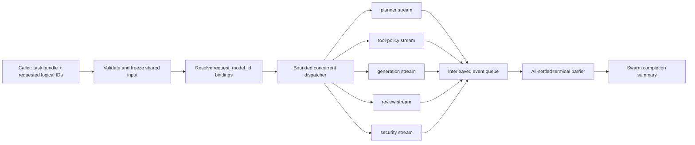

# RFC: Neural Swarm multi-stream execution pipeline

Status: research execution scaffold 0.1
Branch: `research/neural-swarm-kv`
Claim scope: `execution_scaffold_only`

## Purpose

The Neural Swarm runtime cannot be represented faithfully by a conventional
one-model, one-response API. One task bundle may activate several logical
experts, and each expert must be addressable, observable, cancellable, and able
to stream independently while consuming the same task-scoped input.

This RFC defines that control-plane and event-plane contract. It does not claim
that the current scaffold overlaps CUDA kernels, shares KV cache correctly, or
improves throughput. It also does not define evaluation groups. Evaluation arms
and promotion criteria remain a later user-owned design decision.

The normative configuration is
[`configs/research/neural_swarm_streaming_mvp.yaml`](../../configs/research/neural_swarm_streaming_mvp.yaml),
and emitted events follow
[`configs/research/neural_swarm_stream_event.schema.json`](../../configs/research/neural_swarm_stream_event.schema.json).
The transport-neutral controller is implemented in
[`src/anchor_mvp/research/neural_swarm_streaming.py`](../../src/anchor_mvp/research/neural_swarm_streaming.py).

## Small, content-free smoke test

Run the synthetic backend without loading a model or dataset:

```powershell
python scripts/research/demo_neural_swarm_streaming.py --max-concurrency 3
```

The command reads the configured bindings, selects every logical model ID by
default, and prints JSONL events followed by one content-free summary. Event
lines are the event-schema objects themselves; only the separate summary line
uses `record_type: summary`. Repeat the
`--request-model-id anchor-swarm/<name>` option to select a subset. Before
dispatch, the demo strictly checks the claim boundary, non-claims, dispatch
invariants, streaming switches, observability switches, and the referenced
event-schema identity and fields. This smoke test validates routing and stream
coordination only; it consumes neither GPU memory nor provider quota.

## Identity and routing contract

The runtime keeps three identifiers separate:

| Identifier | Owner | Purpose |
| --- | --- | --- |
| `request_model_id` | external caller | Stable logical name used when requesting a capability, such as `anchor-swarm/planner`. |
| `expert_id` | Neural Swarm controller | Stable expert-role identity used for orchestration and telemetry. |
| `backend_model_id` | serving backend | Concrete model or adapter route that may change with deployment or training version. |

An external `request_model_id` is not a backend model name. Before dispatch, the
controller resolves it to exactly one `expert_id` and one `backend_model_id`.
Unknown IDs, duplicate bindings, or ambiguous routes must fail before any expert
work starts. This indirection lets clients keep stable names while adapters,
quantizations, serving engines, or deployment revisions change underneath.

The initial bindings are routing examples, not evaluation groups and not a
claim that every task must activate every expert.

## Shared task input and concurrent fan-out

One invocation is identified by `run_id` and one canonical
`task_bundle_sha256`. The controller accepts the shared input once under
`anchor.neural-swarm-shared-input.v1`, freezes the task-scoped value for that
run, resolves the requested routes, and fans the same input out to the selected
experts. Expert-local request envelopes may add routing metadata, but must not
silently rewrite the shared task bundle.



Concurrency is bounded by `dispatch.max_concurrency`; it is not synonymous with
GPU concurrency. The queue capacity provides backpressure. A backend may be a
mock, a remote API, a local inference engine, or a future shared-KV executor as
long as it implements the streaming contract.

## Current integration boundary

The checked-in controller remains transport-neutral, and the default smoke test
still uses a deterministic synthetic backend. A separate
[`OpenAICompatibleSSEBackend`](../../src/anchor_mvp/research/neural_swarm_openai_backend.py)
now maps each resolved `backend_model_id` to an OpenAI-compatible Chat
Completions streaming request. Its routing, fragmented-SSE parsing,
cancellation, early-close cleanup, credential redaction, and protocol failures
are covered with in-memory transports only. It has not contacted a real vLLM,
llama.cpp, or provider endpoint and has not loaded model weights.

The optional adapter requires the repository's `teacher` extra (`httpx`). It
accepts only text Chat Completions with one choice; tool calls, audio,
Responses API events, retries, and connection-pool tuning remain outside this
milestone.

The next live integration must remain deliberately small: point the reviewed
adapter at one local endpoint, select one or two logical IDs, cap output length,
and verify routing, cancellation, terminal events, and memory behavior before
increasing concurrency. That integration is not an evaluation group and must
not be used to claim GPU overlap or KV reuse.

## Event contract and ordering

Every event carries the complete routing identity needed to demultiplex it:

- `run_id` and `task_bundle_sha256` bind the event to one invocation;
- `stream_id`, `expert_id`, `request_model_id`, and `backend_model_id` identify
  the logical and physical route;
- `per_stream_sequence` orders events within one stream;
- `global_sequence` provides a single emission order across interleaved streams;
- `event_type` and `elapsed_ms` describe state and time since run start.

Supported event types are `started`, `delta`, `completed`, `failed`,
`cancelled`, `barrier`, and `swarm_completed`. Delta events may carry a text
fragment. Error events may carry `error_type` and `error_message`. Extensible
backend measurements belong in `metadata`; consumers must not infer evaluation
membership from it.

The two sequence numbers serve different purposes. Consumers reconstruct an
individual answer using `per_stream_sequence`, while logs and live UIs use
`global_sequence` to reproduce the observed interleaving. Arrival time alone is
not a stable ordering contract.

## Terminal, failure, and cancellation semantics

The MVP uses an `all_settled` terminal barrier:

1. each selected expert emits `started` and then zero or more `delta` events;
2. each stream reaches exactly one terminal outcome: `completed`, `failed`, or
   `cancelled`;
3. after every selected stream is terminal, the controller emits `barrier`;
4. it then emits `swarm_completed` with the run summary.

With `fail_fast: false`, one backend failure is isolated to its stream; other
experts continue and the final summary records the mixed outcome. With
`fail_fast: true`, the first failure requests cancellation of unfinished
streams, but those streams still emit terminal cancellation events before the
barrier. Explicit cancellation uses the configured cancellation event and has
the same cleanup requirement. No path may emit the barrier while a selected
stream remains non-terminal.

## Observability contract

The execution scaffold exposes measurement hooks rather than benchmark claims.
The controller records or can derive:

- elapsed time per event;
- time to first delta per stream;
- delta count and output units;
- terminal outcome and error type;
- interleaving and barrier timing.

Backends may additionally report `prompt_tokens`, `completion_tokens`,
`tokens_per_second`, `peak_vram_bytes`, `kv_cache_bytes`, `shared_kv_bytes`, and
`private_kv_bytes`. These optional fields describe what a backend reports; they
do not prove cache correctness, physical sharing, CUDA overlap, or causal
speedup. Any later benchmark must bind its own independently reviewed design to
these neutral hooks.

## Explicit non-claims and deferred decisions

This milestone establishes only ID resolution, shared-input fan-out,
multi-stream event transport, terminal coordination, cancellation, failure
isolation, and telemetry hooks. It does **not** establish:

- CUDA-stream overlap or concurrent GPU execution;
- mathematically valid shared-KV reuse;
- shared-KV memory savings or latency/throughput gains;
- production readiness;
- any A/B or named evaluation group.

Evaluation groups are deliberately absent from the configuration, event schema,
and this RFC. They will be defined only after the user confirms the hypotheses,
controls, workload, and promotion gates.

## Attribution

This execution-pipeline RFC was developed with coding and architecture
assistance from OpenAI GPT-5.6-sol. It does not present upstream work, synthetic
scaffold behavior, or unmeasured runtime properties as an Anchor-MoE-LoRA
result.
