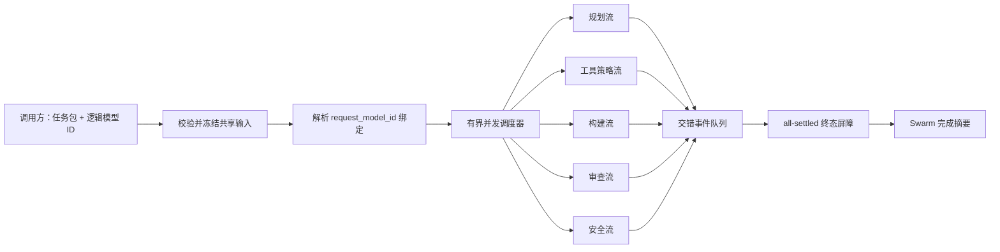

# RFC：Neural Swarm 多流执行管线

状态：研究执行脚手架 0.1
分支：`research/neural-swarm-kv`
声明范围：`execution_scaffold_only`

## 目的

Neural Swarm 不能被传统的“一个模型对应一个响应”接口准确表达。同一个任务包可能激活多个逻辑专家；每个专家都需要被独立寻址、观测和取消，并在读取同一份任务输入的同时独立流式输出。

本文只定义控制面与事件面的契约，不声称当前脚手架已经实现 CUDA kernel 重叠、正确共享 KV Cache 或提高吞吐。本 RFC 也不定义评测组；评测分组与晋级标准留待用户后续单独确立。

规范配置为 [`configs/research/neural_swarm_streaming_mvp.yaml`](../../configs/research/neural_swarm_streaming_mvp.yaml)，事件必须符合 [`configs/research/neural_swarm_stream_event.schema.json`](../../configs/research/neural_swarm_stream_event.schema.json)。
与传输协议无关的控制器实现在 [`src/anchor_mvp/research/neural_swarm_streaming.py`](../../src/anchor_mvp/research/neural_swarm_streaming.py)。

## 小规模、无真实内容的冒烟验证

无需加载模型或数据集即可运行合成后端：

```powershell
python scripts/research/demo_neural_swarm_streaming.py --max-concurrency 3
```

该命令读取配置中的 bindings，默认选中全部逻辑模型 ID，并依次打印 JSONL 事件与一条无内容摘要。事件行就是事件 schema 对象本身；只有单独的摘要行使用 `record_type: summary`。若只测试部分专家，可重复传入 `--request-model-id anchor-swarm/<name>`。分发前，demo 会严格校验声明边界、非声明项、调度不变量、流式开关、可观测性开关，以及所引用事件 schema 的身份和字段。此冒烟验证只检查路由与多流协调，不占用 GPU 显存，也不消耗模型供应商额度。

## 身份与路由契约

运行时严格区分三类 ID：

| ID | 所有者 | 用途 |
| --- | --- | --- |
| `request_model_id` | 外部调用方 | 请求能力时使用的稳定逻辑名称，例如 `anchor-swarm/planner`。 |
| `expert_id` | Neural Swarm 控制器 | 编排与遥测使用的稳定专家角色身份。 |
| `backend_model_id` | 推理后端 | 具体模型或 adapter 路由，可随部署或训练版本变化。 |

外部 `request_model_id` 绝不是后端模型名。控制器必须在分发任何工作之前，把它唯一解析为一个 `expert_id` 和一个 `backend_model_id`。未知 ID、重复绑定或歧义路由必须在执行前关闭失败。借助这一层解耦，客户端可以保持稳定名称，而底层 adapter、量化格式、推理引擎和部署版本均可独立演进。

初始 bindings 只是路由示例，不是评测组，也不表示每项任务必须激活全部专家。

## 共享任务输入与并发扇出

一次调用由 `run_id` 和唯一的 `task_bundle_sha256` 标识。控制器按 `anchor.neural-swarm-shared-input.v1` 接收一次共享输入，在本次运行中冻结该任务值，解析所请求的路由，然后把同一份输入并发扇出给被选中的专家。专家局部请求可以附加路由元数据，但不得暗中改写共享任务包。



并发受 `dispatch.max_concurrency` 限制，但“异步并发”不等同于“GPU 物理并行”。队列容量负责背压。只要实现流式契约，后端可以是 mock、远程 API、本地推理引擎或未来的共享 KV 执行器。

## 当前集成边界

仓库中的控制器仍与传输协议无关，默认冒烟验证也仍只使用确定性的合成后端。现在另有独立的 [`OpenAICompatibleSSEBackend`](../../src/anchor_mvp/research/neural_swarm_openai_backend.py)：它把解析后的 `backend_model_id` 映射为 OpenAI-compatible Chat Completions 流式请求。路由、分片 SSE 解析、取消、提前关闭清理、凭据隐藏和协议失败均只通过内存 transport 验证；它尚未连接真实 vLLM、llama.cpp 或供应商端点，也没有加载模型权重。

该可选适配器依赖仓库的 `teacher` extra（`httpx`），当前只接受单 choice 的文本 Chat Completions；工具调用、音频、Responses API 事件、重试和连接池调优不属于本里程碑。

下一步真实接入必须保持小规模：把已复核适配器指向一个本地端点，只选择一到两个逻辑 ID，限制输出长度，并在提高并发前验证路由、取消、终态事件和内存行为。该接入不是评测组，也不能用来声称 GPU 重叠或 KV 复用。

## 事件契约与顺序

每个事件都携带完成解复用所需的路由身份：

- `run_id` 与 `task_bundle_sha256` 把事件绑定到一次调用；
- `stream_id`、`expert_id`、`request_model_id` 和 `backend_model_id` 标识逻辑与物理路由；
- `per_stream_sequence` 定义单条流内顺序；
- `global_sequence` 定义所有交错流的统一发出顺序；
- `event_type` 与 `elapsed_ms` 描述状态和相对运行起点的耗时。

事件类型包括 `started`、`delta`、`completed`、`failed`、`cancelled`、`barrier` 和 `swarm_completed`。`delta` 可以携带文本片段；错误事件可以携带 `error_type` 和 `error_message`；可扩展后端观测值放入 `metadata`。消费者不得从 `metadata` 猜测评测组归属。

两个序号承担不同职责：消费者使用 `per_stream_sequence` 重建某个专家的答案，日志和 WebUI 使用 `global_sequence` 复现真实观察到的交错顺序。仅凭到达时间不能形成稳定的顺序契约。

## 终态、失败与取消语义

MVP 使用 `all_settled` 终态屏障：

1. 每个选中专家先发出 `started`，随后发出零个或多个 `delta`；
2. 每条流最终且只能进入一个终态：`completed`、`failed` 或 `cancelled`；
3. 所有选中流都进入终态后，控制器发出 `barrier`；
4. 随后发出携带运行摘要的 `swarm_completed`。

当 `fail_fast: false` 时，一个后端失败只终止自己的流，其他专家继续执行，最终摘要记录混合结果。当 `fail_fast: true` 时，第一个失败会请求取消尚未结束的流，但这些流仍必须先发出终态取消事件，控制器才能越过屏障。显式取消使用配置中的取消事件，并遵守同样的清理约束。任何仍存在非终态流的路径都不得提前发出屏障。

## 可观测性契约

执行脚手架提供的是测量钩子，而不是跑分结论。控制器记录或可以推导：

- 每个事件的 `elapsed_ms`；
- 每条流的首个 delta 延迟；
- delta 数与输出单位数；
- 终态结果与错误类型；
- 流交错与屏障时序。

后端还可以上报 `prompt_tokens`、`completion_tokens`、`tokens_per_second`、`peak_vram_bytes`、`kv_cache_bytes`、`shared_kv_bytes` 和 `private_kv_bytes`。这些可选字段只代表后端报告的测量值，不能证明缓存正确、物理共享、CUDA 重叠或因果加速。未来评测必须在独立复审后，把自己的实验设计绑定到这些中性钩子上。

## 明确不声明的成果与待定事项

当前里程碑只建立 ID 解析、共享输入扇出、多流事件传输、终态协调、取消、失败隔离和遥测钩子。它不证明：

- CUDA Stream 重叠或 GPU 并发执行；
- KV 共享在数学上正确；
- 共享 KV 节省显存或提高延迟/吞吐；
- 已达到生产可用；
- 任何 A/B 或具名评测组。

配置、事件 schema 与本 RFC 均刻意不包含评测组。只有在用户确认研究假设、控制变量、工作负载和晋级门槛后，才会另行定义评测组。

## 致谢

本执行管线 RFC 由 OpenAI GPT-5.6-sol 协助完成代码语境梳理与架构设计。本文不把上游成果、合成脚手架行为或尚未测量的运行时属性写成本项目已经取得的结果。
