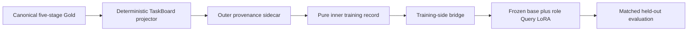

# RFC: Role-conditioned Query-specialization training MVP

Status: experimental training scaffold 0.3
Branch: `research/neural-swarm-kv`
Claim scope: `experimental_proxy_scaffold_only`
Consumed producer scope: `research_proxy_only`

[简体中文](neural_swarm_query_specialization.zh-CN.md) ·
[Parent Neural Swarm RFC](neural_swarm_kv.md)

## Decision

Build the smallest training-side experiment that can test one narrow question:

> Given the same structured TaskBoard, can five role-specific low-rank Query
> projections learn to select their own evidence while ignoring unrelated
> blocks on source-task-disjoint examples?

The current implementation is a contract-checked CPU surrogate and a
deterministic bridge into the existing completion-only trainer. It has **not**
yet fine-tuned the foundation model. Its current result is
`proxy_signal_passed=false`; no model-quality or promotion claim is authorized.

## Boundary with distillation



The canonical planner → tool-policy → builder → reviewer → security Gold is
immutable. The projector writes only sidecars. The training consumer never
rewrites canonical Gold and never moves provenance into the inner training
record.

The TaskBoard is logical shared memory. Q-only LoRA does not by itself prove
that all decoder layers can share one physical KV allocation: role-specific
Query changes attention output, so later hidden states and K/V may diverge.
Exact or approximate shared-KV execution remains a separate runtime experiment.

## Authoritative producer contract

Training consumes outer records with schema version
`anchor.swebench-taskboard-sidecar.v1`. The checked-in producer contracts are:

| Contract | SHA256 |
| --- | --- |
| `configs/research/taskboard_projector_sidecar.schema.json` | `654e9f7fddbe67885156c4e1fac9aa48c0b415c6fb52d3dcf501d53520b6f146` |
| `configs/research/taskboard_projector_manifest.schema.json` | `75dc191849a0fba084dbc81064e7c5634c8727b41ad4b62522e3a28ecd727e53` |
| `configs/research/swebench_taskboard_projector_v1.yaml` | `5d1207bf0a16f84c7cfa3448350b2a26f4127384664704b967c7c4280c9e63c9` |

Training-owned machine-readable contracts are
[`query_specialization_record.schema.json`](../../configs/research/query_specialization_record.schema.json)
for the pure inner record,
[`query_specialization_sft_view.schema.json`](../../configs/research/query_specialization_sft_view.schema.json)
for completion-only materialization, and
[`query_specialization_metrics.schema.json`](../../configs/research/query_specialization_metrics.schema.json)
for content-free proxy results. Their execution parameters live in
[`query_specialization_mvp.yaml`](../../configs/research/query_specialization_mvp.yaml).

The fixed producer output layout is:

```text
train/clean.jsonl
train/noisy.jsonl
calibration/clean.jsonl
manifest.json
```

The outer wrapper carries immutable lineage:

- source Gold record, file, and content hashes;
- snapshot and snapshot-manifest hashes;
- task-bundle and base-TaskBoard hashes;
- projector version, projector-config hash, and sidecar-schema hash;
- split-before-augmentation metadata;
- the inner `training_record`.

The inner record remains exactly `anchor.query-specialization.v1`: identity,
pair, variant, language, split, role, TaskBoard, attention targets, and target.
It contains no provenance object.

The consumer rejects unknown fields and validates these equalities:

- wrapper `id`, `pair_id`, `variant`, and `split` equal the inner record;
- wrapper `expert` maps to the inner role;
- wrapper `stage` maps to its expert;
- clean rows have empty clean augmentation;
- noisy rows are train-only, use `stale_duplicate_overlay`, declare the overlay
  block IDs, and preserve `split_before_augmentation=true`;
- one source task contributes all five roles;
- train contributes one clean/noisy pair per role;
- calibration contributes clean records only;
- every descendant of a source task remains in one split.

The split/group key is `task_bundle_sha256`, cross-checked against the inner
`task_board.task_id`. It is deliberately **not** `source_gold_record_id`: the
five stages of one task have five distinct Gold record IDs. Any later
train/eval regrouping must keep every role view of one task bundle together.

Calibration is for allocation and threshold calibration. It is not held-out
evaluation and must not be reported as such.

The producer's physical `task_board` intentionally still contains current and
future block text. `forbidden_block_ids` is therefore a causal boundary, not
just an auxiliary label. The consumer must call `build_training_view` before
serialization; directly stringifying either the wrapper or the full board is a
contract violation. The compatibility suite exercises the real builder and
materializer for all 15 fixture rows and verifies that every relevant block is
present while every forbidden block ID and its text—including the current
target answer and future-stage answers—is absent from the user prompt.

All input authentication uses immutable in-memory byte snapshots. Manifest
sidecar verification authenticates the exact manifest bytes that are parsed.
`manifest.json.sha256` is mandatory and must be exactly
`<64 lowercase hex>  manifest.json` with at most one trailing LF; missing,
renamed, or non-standard declarations fail closed. Each partition's byte
length, SHA256, record count, and JSONL decoding operate on one read. Reopening
a path after authentication is forbidden, so concurrent path replacement
cannot switch the bytes consumed by the trainer.

## Producer status consumed by this branch

The upstream producer reports:

- execution-focused regressions: 264/264;
- projector and release-freeze regressions: 25/25;
- offline preflight: 19,008 tasks / 95,040 work orders;
- provider requests during preflight: 0;
- canonical Gold written: false;
- held-out content read or emitted: false.

These numbers validate the producer contract, not model quality. The checked-in
consumer fixture has 15 generated sidecars: five train-clean, five train-noisy,
and five calibration-clean records covering all five experts.

Current consumer compatibility status: 15/15 outer records pass both the
official JSON Schema and semantic loader; 15/15 pass the real causal prompt
filter and SFT-view schema; deterministic materialization reports
`bridge_contract_passed=true` and produces 10 role/split shards. The focused
Query-specialization, release-consumer, and Neural Swarm suites pass; exact
test counts are intentionally left to CI so this RFC does not become stale.

The consumer now authenticates the pinned
`anchor.generic-train-release-lock.v1` schema and, when a full-model path is
enabled, requires a real ready manifest, strict SHA sidecar, the three fixed
partition bindings, five-role task-bundle grouping, and the current consumer
source hashes. The checked-in configuration remains explicitly unavailable and
reports `formal_training_authorized=false`, because no real frozen formal-v3
release artifact exists yet.

## Training view and loss contract

The training bridge emits deterministic
`anchor.query-specialization-sft-view.v1` completion-only views. The user
message is canonical TaskBoard JSON after visibility filtering; the assistant
message is the canonical strict-JSON target. Lineage in the emitted view comes
from the outer sidecar.

Outputs are content-addressed, split/role separated, capped below 48 MB per
JSONL shard, and accompanied by a content-free manifest. The bridge never
pretends these views are canonical Gold.

The proxy block objective uses a uniform target across every required relevant
block and penalizes distractor mass:

\[
L_{rel} = -\sum_{b \in R}\frac{1}{|R|}\log p(b), \qquad
L = L_{rel} + \lambda_d\sum_{b \in D}p(b)
\]

Direct attention supervision is disabled for the foundation-model path until a
verified token-to-block span map and length-normalized aggregation exist.

## Lightweight CPU proxy

The proxy freezes a 48×48 base Query projection and trains five independent
rank-4, alpha-8 residuals. The contract fixture supplies only the role-to-block
kind mapping; it is not used for gradient updates. Synthetic train and eval
tasks use disjoint task IDs.

Current unseen synthetic evaluation:

| Metric | Before | After |
| --- | ---: | ---: |
| Top-1 relevant rate | 0.6000 | 1.0000 |
| Relevant mass | 0.3352 | 0.8448 |
| Minimum required-block mass | 0.0138 | 0.1952 |
| Distractor mass | 0.6648 | 0.1552 |
| Correct-role mass gap | 0.0000 | 0.0937 |
| Clean/noisy Query cosine | 0.9989 | about 1.0000 |

Five of six predeclared signal checks passed. Distractor mass did not satisfy
the `≤ 0.12` gate, so the result remains:

```text
proxy_signal_passed = false
```

This is a useful negative/yellow result: the tiny residual learned the labelled
selection pattern, but did not suppress noise strongly enough. Thresholds were
not relaxed after observing the result.

## Execution and metric gates

The gates are deliberately independent:

1. `producer_contract_passed`: official schema, manifest, hashes, layout, and
   producer invariants validate.
2. `bridge_contract_passed`: the training consumer parses and deterministically
   materializes every sidecar.
3. `mechanical_q1_smoke_passed`: one foundation-model step can train, save, and
   reload a text-tower-only `q_proj` adapter.
4. `proxy_signal_passed`: the source-task-disjoint CPU surrogate meets all
   predeclared thresholds.
5. matched Q0/Q1/Q2 held-out evaluation: the first model-quality gate.

Passing gates 1–4 is not evidence that Query specialization improves a real
model. Current same-dataset or role/task-collinear probes are diagnostic only.

## Run locally

Contract-only proxy validation:

```powershell
python scripts/research/train_query_specialization_mvp.py --dry-run
```

CPU proxy:

```powershell
python scripts/research/train_query_specialization_mvp.py --execute
```

Materialize completion-only views:

```powershell
python scripts/research/materialize_query_specialization_sft.py --dry-run
python scripts/research/materialize_query_specialization_sft.py --execute
```

The scripts read the three fixed partitions and `manifest.json` from
`fixtures/research/taskboard_projector` unless the configuration overrides the
fixture root.

## Remaining real-training work

Before a real Q1 run is authorized:

1. produce the real frozen formal-v3 projector/release artifacts and pin their
   final manifest SHA; the consumer-side binding is implemented but remains
   fail-closed without those artifacts;
2. verify an exact text-tower `q_proj` module-name allowlist so multimodal
   modules with the same leaf name cannot receive adapters;
3. implement block-aware token budgeting and reject truncation that removes a
   referenced relevant block;
4. run a one-step NF4/BF16 train → save → reload mechanical smoke;
5. record mounted module names, adapter/profile/config/schema/data hashes, and
   runtime versions in the artifact manifest;
6. implement token-to-block attention aggregation before enabling auxiliary
   attention loss;
7. produce source-task-disjoint held-out data and run matched Q0/Q1/Q2 tests for
   generation quality, strict JSON, evidence selection, latency, and memory;
8. keep calibration separate from held-out evaluation and report failures,
   exclusions, and confidence intervals.

Until those items are complete, this branch is a reproducible training MVP and
consumer-contract experiment—not a successful Neural Swarm model.
