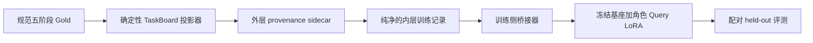

# RFC：按角色专门化 Query 的训练 MVP

状态：实验性训练脚手架 0.3
分支：`research/neural-swarm-kv`
声明范围：`experimental_proxy_scaffold_only`
所消费生产方范围：`research_proxy_only`

[English](neural_swarm_query_specialization.md) ·
[Neural Swarm 父 RFC](neural_swarm_kv.zh-CN.md)

## 决策

先用最小训练实验回答一个窄问题：

> 面对同一块结构化 TaskBoard，五个角色各自的低秩 Query 投影，能否在
> 源任务隔离的数据上只选择自己需要的证据，并忽略无关块？

当前实现只有经过契约校验的 CPU 代理实验，以及连接现有
completion-only 训练器的确定性桥接层；尚未微调基座模型。当前结果是
`proxy_signal_passed=false`，不能据此声称模型质量提升或允许晋级。

## 与蒸馏侧的边界



规划 → 工具审批 → 构建 → 领域审查 → 安全放行的规范 Gold 完全不改。
投影器只写 sidecar；训练消费端绝不重写规范 Gold，也不把 provenance
塞进内层训练记录。

TaskBoard 是逻辑共享内存。仅训练 Q-LoRA 并不能证明所有解码层都能共享
同一份物理 KV：角色 Query 会改变注意力输出，后续隐藏状态和 K/V 可能
分叉。精确或近似的共享 KV 仍属于独立的运行时实验。

## 权威生产方契约

训练侧消费外层 `anchor.swebench-taskboard-sidecar.v2`。仓库内固定的生产
契约为：

| 契约 | SHA256 |
| --- | --- |
| `configs/research/swebench_taskboard_projector_v2.yaml` | `b36945a2693183f0b213da403afcf8bb5611f46298bb849434e7b7d5854ba943` |
| `configs/research/taskboard_projector_sidecar.schema.json` | `c1863bfab69ce2f2388ee37fadae951b14f3d5120706bab032cab3f9aab6bdc5` |
| `configs/research/hierarchical_task_kv_segment_plan.schema.json` | `80f760497e0d21f7d4d532db758362a800e845e6919b18b23958caabc7f155bf` |
| `configs/research/taskboard_projector_manifest.schema.json` | `2cd9dc98d2b2865ed0586abfe291e3f6d161686597fcd2a7884c5762d2195347` |
| 生产方 fixture `manifest.json` | `595cd150845015f3723e28a6aa0cb48730cdca6457580ad66a393ef4143fa2ac` |

v1 projector 配置仅保留为历史材料；当前 fixture 与消费端均不接受它。

训练侧的机器可读契约包括：纯内层记录的
[`query_specialization_record.schema.json`](../../configs/research/query_specialization_record.schema.json)、
completion-only 物化视图的
[`query_specialization_sft_view.schema.json`](../../configs/research/query_specialization_sft_view.schema.json)，以及
不含正文的代理指标
[`query_specialization_metrics.schema.json`](../../configs/research/query_specialization_metrics.schema.json)。
执行参数位于
[`query_specialization_mvp.yaml`](../../configs/research/query_specialization_mvp.yaml)。

生产方输出目录固定为：

```text
train/clean.jsonl
train/noisy.jsonl
calibration/clean.jsonl
manifest.json
```

外层 wrapper 保存不可变来源链：

- Gold 记录 ID、文件哈希与内容哈希；
- snapshot 与 snapshot manifest 哈希；
- task bundle 与基础 TaskBoard 哈希；
- projector 版本、projector 配置哈希、sidecar schema 哈希与原生 segment
  plan schema 哈希；
- 先切分后增强的元数据；
- 由生产方写入的原生 `segment_plan`（当前消费端接受的唯一物理缓存计划来源）；
- 内层 `training_record`。

内层记录严格保持 `anchor.query-specialization.v1`：身份、pair、variant、
语言、split、role、TaskBoard、注意力目标和输出目标。内层没有 provenance。

消费端采用 fail-closed 校验：

- wrapper 的 `id`、`pair_id`、`variant`、`split` 必须与内层相等；
- wrapper 的 `expert` 必须映射到内层 role；
- stage 必须与 expert 匹配；
- clean 的 augmentation 必须为空；
- noisy 只能属于 train，必须是 `stale_duplicate_overlay`，必须声明 overlay
  块，并保持 `split_before_augmentation=true`；
- 同一源任务必须产生五个角色；
- train 的每个角色必须有 clean/noisy pair；
- calibration 只能有 clean；
- 同一源任务的全部后代只能落在一个 split。

split/group key 固定为 `task_bundle_sha256`，并与内层
`task_board.task_id` 交叉核对；绝不能使用 `source_gold_record_id`，因为同一
任务的五个阶段各自拥有不同 Gold record ID。后续任何 train/eval 再分组都
必须让同一 task bundle 的五个角色始终留在一起。

calibration 只用于容量分配和阈值校准，不是 held-out 评测，不能按正式
评测结果汇报。

生产方的物理 `task_board` 会刻意保留当前及未来阶段的块正文，因此
`forbidden_block_ids` 是因果边界，而不只是一个辅助标签。消费端必须先调用
`build_training_view` 再序列化；直接 stringify wrapper 或完整 TaskBoard 都是
契约违规。兼容测试让 15 条夹具逐条经过真实 builder 和 materializer，验证
全部 relevant 块仍在 user prompt，同时全部 forbidden 块 ID 与正文——包括
当前 target answer 和未来阶段答案——都不进入 user prompt。

所有输入认证均基于不可变的内存 bytes snapshot。manifest sidecar 校验的
正是随后解析的那份 manifest bytes。`manifest.json.sha256` 为必需文件，且
只能是 `<64 位小写 hex>  manifest.json`，最多允许一个末尾 LF；缺失、错
文件名或非标准声明全部 fail-closed。每个 partition 的字节长度、SHA256、
记录数和 JSONL 解析也只使用一次读取所得的同一份 bytes。认证后禁止重新
打开路径，因此并发替换路径不能切换训练器实际消费的数据。

## 当前已消费的生产方状态

上游生产方报告：

- execution 聚焦回归 264/264；
- projector 与 release-freeze 回归 25/25；
- 离线预检 19,008 个任务 / 95,040 个 work order；
- 预检 provider request 为 0；
- 没有写 canonical Gold；
- 没有读取或导出 held-out 正文。

这些数字只证明生产契约，不证明模型质量。仓库中的兼容夹具包含 15 条
生产方格式 sidecar：train-clean 五条、train-noisy 五条、
calibration-clean 五条，覆盖全部五个专家。

当前消费兼容状态：15/15 条外层记录同时通过官方 JSON Schema 与语义
loader；15/15 条通过真实因果 prompt 过滤和 SFT-view schema；确定性物化器
得到 `bridge_contract_passed=true`，生成 10 个 role/split 分片。Query
专门化、release consumer 与 Neural Swarm 聚焦套件均通过；精确测试数量交给
CI 展示，避免 RFC 数字随新增回归用例失效。

消费端现在会认证固定的 `anchor.generic-train-release-lock.v1` schema；启用
完整模型路径时，还会强制要求真实 ready manifest、严格 SHA sidecar、三个
固定分区绑定、同 task bundle 的五角色约束，以及当前消费端源码哈希。由于
真实 frozen formal-v3 release artifact 尚不存在，仓库默认配置继续显式标记
unavailable，并报告 `formal_training_authorized=false`。

## 训练视图与损失契约

桥接器确定性生成 `anchor.query-specialization-sft-view.v1` completion-only
视图：user 消息是经过可见性过滤的规范 TaskBoard JSON，assistant 消息是
规范的严格 JSON target；视图的来源链只取自外层 sidecar。

输出按 split 和 role 隔离、内容寻址、单个 JSONL 小于 48 MB，并附带不含
正文的 manifest。桥接器不会把这些视图伪装成规范 Gold。

CPU 代理的块级目标对所有必需相关块分配均匀概率，同时惩罚 distractor：

\[
L_{rel} = -\sum_{b \in R}\frac{1}{|R|}\log p(b), \qquad
L = L_{rel} + \lambda_d\sum_{b \in D}p(b)
\]

在 token→block span 映射和长度归一化聚合得到验证前，正式模型路径禁止
直接启用注意力辅助损失。

## 轻量 CPU 代理结果

代理冻结 48×48 的基础 Query 投影，为五个角色分别训练 rank-4、alpha-8
的残差。官方格式夹具只提供 role→block-kind 映射，不参与梯度更新；
合成 train/eval 的任务 ID 完全隔离。

当前未见合成任务上的结果：

| 指标 | 训练前 | 训练后 |
| --- | ---: | ---: |
| Top-1 相关块命中率 | 0.6000 | 1.0000 |
| 相关块质量 | 0.3352 | 0.8448 |
| 最小必需块质量 | 0.0138 | 0.1952 |
| 干扰块质量 | 0.6648 | 0.1552 |
| 正确角色质量差 | 0.0000 | 0.0937 |
| clean/noisy Query 余弦 | 0.9989 | 约 1.0000 |

六个预声明信号门中通过五个；干扰块质量没有达到 `≤ 0.12`，所以仍为：

```text
proxy_signal_passed = false
```

这是有价值的黄灯/负结果：最小残差学到了标注选择模式，但抑制噪声还不
够强。观察结果后没有放宽阈值。

## 执行与指标门控

各门控相互独立：

1. `producer_contract_passed`：官方 schema、manifest、哈希、目录和生产方
   不变量全部通过；
2. `bridge_contract_passed`：训练侧能解析并确定性物化全部 sidecar；
3. `mechanical_q1_smoke_passed`：基座模型能完成一次仅文本塔 `q_proj` 的
   训练、保存和重载；
4. `proxy_signal_passed`：源任务隔离的 CPU 代理通过全部预声明阈值；
5. 配对 Q0/Q1/Q2 held-out 评测：第一个真正的模型质量门。

通过 1–4 也不能证明真实模型得到提升。同集评测或 role/task 共线 probe
只能算诊断信号。

## 本地运行

只验证契约：

```powershell
python scripts/research/train_query_specialization_mvp.py --dry-run
```

运行 CPU 代理：

```powershell
python scripts/research/train_query_specialization_mvp.py --execute
```

物化 completion-only 训练视图：

```powershell
python scripts/research/materialize_query_specialization_sft.py --dry-run
python scripts/research/materialize_query_specialization_sft.py --execute
```

默认从 `fixtures/research/taskboard_projector` 读取固定三分区和
`manifest.json`，除非配置显式覆盖夹具根目录。

## 尚未完成的真实训练项

正式启动 Q1 前仍需：

1. 生成真实 frozen formal-v3 projector/release artifact 并固定最终 manifest
   SHA；消费端绑定已经实现，但缺少这些真实产物时继续 fail-closed；
2. 校验精确的文本塔 `q_proj` 模块全名白名单，避免同名多模态模块误挂；
3. 实现 block-aware token budget，引用的 relevant block 一旦会被截断就
   fail-closed；
4. 跑一次 NF4/BF16 的 train → save → reload 机械 smoke；
5. 在产物 manifest 记录实际挂载模块、adapter/profile/config/schema/data
   哈希和运行时版本；
6. 实现 token→block 注意力聚合后再启用注意力辅助损失；
7. 准备源任务隔离的 held-out 数据，对 Q0/Q1/Q2 做生成质量、严格 JSON、
   证据选择、时延与显存的配对评测；
8. calibration 与 held-out 评测严格分开，并报告失败、剔除项和置信区间。

这些工作完成前，本分支只是可复现的训练 MVP 与消费契约实验，不是已经
成功的 Neural Swarm 模型。
