# Natural-language scaffold producer contract

[简体中文](swebench_natural_language_scaffold.zh-CN.md)

## Status, terminology, and normative scope

This document specifies the v1 producer boundary for an auditable
natural-language scaffold downstream of the authenticated SWE-bench TaskBoard
projector. “MUST”, “MUST NOT”, “SHOULD”, and “MAY” are normative. The producer
is a deterministic, low-memory research transform. It does not call a model or
provider, train an adapter, tokenize a prompt, or modify canonical Gold or
held-out data.

The architecture label is
`frozen-prefix Q-reader / prefix-branch producer-consumer`. In v1 this is an
interface and execution boundary, not proof that a physical cross-attention
Q-reader or zero-copy KV backend exists. During the shared long-prefix prefill,
Planner/Base runs with every expert adapter off. An expert adapter may become
eligible only after a validated route boundary and only for the expert-private
tail.

The checked-in contract family is:

| Artifact | Contract identity |
| --- | --- |
| `configs/research/swebench_natural_language_scaffold_v1.yaml` | `anchor.natural-language-scaffold-config.v1` |
| `configs/research/swebench_natural_language_scaffold_sidecar.schema.json` | record `anchor.natural-language-scaffold.v1` |
| `configs/research/swebench_natural_language_scaffold_manifest.schema.json` | `anchor.natural-language-scaffold-manifest.v1` |
| `configs/research/swebench_natural_language_scaffold_smoke_contract.schema.json` | `anchor.natural-language-scaffold-smoke-contract.v1` |
| `configs/research/swebench_natural_language_scaffold_smoke_v1.yaml` | the checked-in, non-authorizing smoke instance |
| `src/anchor_mvp/swebench/natural_language_scaffold.py` | `anchor.natural-language-scaffold-producer.v1` implementation |

Schemas are closed, use local authenticated bytes, and must not resolve remote
references. The final manifest binds the physical SHA-256 of every schema,
configuration, source manifest, core producer implementation, and emitted file.
The core module is bound as `producer.implementation_sha256`; the build and
audit CLI file hashes are listed in the Git acceptance report and remain
traceable through the same commit.
The prose deliberately does not duplicate mutable hash values: the
`manifest.json` plus mandatory `manifest.json.sha256` are authoritative. The
release procedure below explains how those values are recomputed from the
committed bytes and compared with the final report.

## Goals and explicit non-goals

The v1 goals are:

- expose a concise, auditable decision interface rather than hidden reasoning;
- bind a strict route directive to allowed evidence, constraints, tools, and
  acceptance criteria;
- produce paired `json_only` and `concise_rationale_plus_json` views for a
  controlled ablation;
- preserve bundle, role, split, augmentation, language, target, evidence, and
  prefix-lineage provenance;
- describe a route/commit/re-encode/next-request boundary without claiming a
  runtime implementation; and
- provide a body-scoped synthetic fixture and a non-authorizing local behavior
  smoke contract with zero provider requests.

The following claims are out of scope and forbidden:

- the rationale is private or hidden chain-of-thought, or preserves reasoning
  capability losslessly;
- an expert generates no KV, attention is `O(1)`, Planner sleeps while Base
  compute disappears, or the whole generation shares one exact KV cache;
- ordinary in-stack Q-LoRA is sufficient for exact full-stack KV reuse;
- a generated sentinel can hot-switch llama.cpp aLoRA in the same request;
- a Planner-private KV tail can be handed directly to an expert as exact KV;
- aLoRA is a cross-attention Q-reader, physical shared KV, token-level MoE, or
  a completed zero-copy implementation;
- a Q4 GGUF file is trainable adapter/base-model weight evidence; or
- a synthetic fixture, a server capability probe, or an allocatable context
  window is a quality, performance, safety, training, or release result.

In a normal decoder, changing the attention output of one layer changes later
hidden states and can therefore change later K/V. Q-only adaptation is a useful
control label and a necessary condition for some designs, but it is not proof
of exact full-layer KV sharing.

## Dataflow and trust boundary

```mermaid
flowchart LR
    A["Frozen canonical Gold / TaskBoard"] --> B["Authenticated projector sidecar + immutable segment plan"]
    B --> C["Visibility filter: allowed ordered chain only"]
    C --> D["Deterministic route directive"]
    D --> E1["json_only"]
    D --> E2["concise_rationale_plus_json"]
    E1 --> F["Validate + explicit commit"]
    E2 --> F
    F --> G["Frozen Base, adapters off: re-encode short committed scaffold"]
    G --> H["New downstream immutable segment + new prefix lineage"]
    H --> I["Next expert request input contains invocation/control segment"]
    I --> J["Expert-only adapter eligibility + private tail KV"]
```



Canonical Gold and the closed inner TaskBoard record remain byte-for-byte
unchanged. Provenance and scaffold metadata live in a downstream outer
sidecar. The producer authenticates the projector manifest, its SHA sidecar,
its fixed partitions, each raw UTF-8 JSONL line, and the segment plan before it
derives anything.

Splitting is by `task_bundle_sha256` before clean/noisy or causal augmentation.
All five views for a task stay in one split and remain cross-bound to the exact
inner `training_record.task_board.task_id`. The canonical stage/expert pairs
are `planner/planner`, `tool_policy/tool_policy`,
`domain_builder/frontend_gen`, `domain_review/frontend_review`, and
`security/security_gate`.

The minimal checked-in fixture selects two authenticated source bundles: one
`train/noisy` bundle and one `calibration/clean` bundle. It emits five roles and
two scaffold variants per bundle, for exactly 20 records. The source
`train/clean` counterpart is still authenticated and used to verify
augmentation invariants; it is not silently mixed into the selected noisy
view.

| Output file | Expected records | Bound source variant |
| --- | ---: | --- |
| `train/json_only.jsonl` | 5 | `noisy` |
| `train/concise_rationale_plus_json.jsonl` | 5 | `noisy` |
| `calibration/json_only.jsonl` | 5 | `clean` |
| `calibration/concise_rationale_plus_json.jsonl` | 5 | `clean` |

This matrix is a contract fixture, not a claim about formal dataset size.
Calibration is never described as held-out.

## Why two requests and an explicit commit are mandatory

llama.cpp aLoRA invocation scanning applies to invocation tokens present in a
new request's input token sequence. It does not watch tokens generated during
that same request and hot-load an adapter when the model happens to emit a
sentinel. The only permitted v1 state transition is therefore:

1. Planner request: produce a candidate concise rationale, route object, tool
   trace, and invocation/control sentinel as a private tail.
2. Validation: authenticate the candidate structure, evidence references,
   policy hashes, route, and acceptance conditions.
3. Commit: record an explicit text/metadata commitment. A commit upgrades
   neither the Planner's KV bytes nor its cache identity.
4. Re-encode: frozen Base, with all adapters off, processes the short committed
   scaffold and emits a new downstream immutable segment and lineage.
5. Expert request: place the committed scaffold/control segment in the next
   request input. Only this request may be eligible for an expert adapter after
   the invocation boundary.
6. Private tail: the expert produces its own incremental KV. Full-generation
   KV sharing remains false.

Planner generation is adapter-private computation. Its hidden states, K/V,
positions, and adapter-dependent lineage are not identical to frozen-Base
encoding. Text equality is not KV identity. The frozen-Base short-segment
re-encode is therefore required before the committed scaffold can become a
downstream immutable segment. A future real cross-attention reader could
define a different mechanism, but v1 neither implements nor claims one.

The machine-readable aLoRA capability must fix:

- `activation_semantics=next_request_input_activation_only`;
- invocation scanning in the next request input only;
- an explicit commit is required;
- `same_request_activation_allowed=false`;
- `mid_request_generated_activation_allowed=false`; and
- `mid_request_generated_trigger_switch_claimed=false`.

The enclosing `route_boundary.semantics` is
`explicit_two_request_commit_boundary`; this is distinct from the narrower
aLoRA `activation_semantics` value.

## Record contract and field meanings

Every record is a closed object. The exact JSON Schema is authoritative; the
groups below explain its semantics without reproducing any sample body.

| Field or group | Meaning and invariant |
| --- | --- |
| `schema_version`, `record_id`, `pair_id` | Versioned record identity. `pair_id` joins only the two scaffold variants of the same role view. IDs must be unique and deterministic. |
| `task_bundle_sha256`, `task_id_sha256`, `source_gold_sha256` | Bundle, exact inner task ID, and frozen source-Gold bindings. One bundle cannot map to multiple task IDs or splits. |
| `split`, `source_variant`, `stage`, `expert`, `language`, `scaffold_variant` | Split/augmentation/role/language axes. Only `json_only` and `concise_rationale_plus_json` are scaffold variants. Language is preserved, not inferred by translating a source. |
| `source_partition_sha256`, `source_line_sha256` | Physical source partition and raw line-byte authentication. Parsing and canonical reserialization must not invent a new source identity. |
| `target_sha256`, `target_binding_sha256` | Content-free binding to the same answer target for both pair members. Target/answer text is not emitted. |
| `allowed_evidence_sha256`, `forbidden_evidence_sha256` | Canonical metadata digests that prove both pair members used the same evidence policy. They do not contain forbidden text. |
| `segment_plan_sha256`, `ordered_segment_ids_sha256`, `terminal_prefix_lineage_sha256` | Exact immutable plan, ordered visible chain, and terminal lineage. Independent block KV concatenation is not permitted. |
| `architecture_contract_sha256`, `adapter_control_policy_sha256`, `serialization_policy_sha256` | Bind the frozen-prefix architecture boundary, control labels, and canonical renderer. |
| `adapter_control_labels`, `training_outcome_claimed` | Fix the ordered `q_only`, `q_plus_o`, `wide_lora` control labels while forcing the producer's training-outcome claim to false. |
| `route_boundary` | Segment-level boundary and state transition. It is not a token offset while the target tokenizer is unbound. |
| `cache_metadata` | Shared-prefix/private-tail scope, exact-reuse limit, identity status, re-encode policy, and false physical/full-generation claims. |
| `routing_json` | Strict role, goal, constraints, allowed/evidence segment references, tool plan, and acceptance criteria. It references authenticated IDs and hashes, not an entire TaskBoard serialization. |
| `routing_json_sha256` | SHA-256 of canonical UTF-8 `routing_json`; it is stable under source object key-order changes. |
| `tool_calls`, `tool_results` | Ordered, schema-constrained sandbox trace. The fixture uses deterministic harmless synthetic operations and results; it does not assert that a real tool was executed. |
| `expert_trigger` | Short post-boundary expert instruction and opaque invocation/control text binding. It has no token ID or token index before tokenizer binding. |
| `alora_invocation` | Optional capability-compatible two-request semantics. It never authorizes activation and never claims an adapter is present or loaded. |
| `canonical_json_payload_sha256` | SHA-256 of the canonical structured payload shared by the two paired views. |
| `concise_rationale_summary` | Present only in `concise_rationale_plus_json`; forbidden in `json_only`. It is brief, auditable decision-basis prose, not hidden CoT. |
| `scaffold_text`, `scaffold_text_sha256` | Deterministic rendering and its exact UTF-8 digest. `json_only` renders only canonical JSON; the plus view prepends the concise rationale and then the identical canonical JSON payload. |
| status/authorization fields | Must preserve zero-request, non-evaluated, non-training, non-release truth. No fixture record can authorize execution. |

The structured training interface consists of four parts:

- `concise_rationale_summary`: a short, inspectable explanation of decision
  basis, present only in the plus view;
- `routing_json`: the strict route/TaskBoard projection;
- `tool_calls` plus `tool_results`: ordered, auditable sandbox trace metadata;
  and
- `expert_trigger`: the short instruction that belongs after the route
  boundary.

Q-only, Q+O, and wide-LoRA are experimental control labels. They describe
consumer group assignments only. The producer must not encode a conclusion
about accuracy, KV compatibility, speed, or preferred adapter width.

## Canonical hashing and paired-view invariants

Canonical JSON is UTF-8 with lexicographically sorted object keys, no
insignificant whitespace, and non-ASCII characters unescaped. Hashes use the
exact canonical bytes, not a language-runtime object hash.

`canonical_json_payload_sha256` covers the strict structured payload used by
both views: route, tool calls, tool results, and expert trigger under the bound
serialization policy. `scaffold_text_sha256` covers the exact rendered bytes
and therefore differs between scaffold variants. The route JSON remains stable
under input object key order changes because it is constructed from an
allowlist and canonicalized before hashing.

Within a `pair_id`, both records MUST match on source bundle/task/Gold, split,
source variant, stage/expert, language, target binding, allowed and forbidden
evidence bindings, segment plan and ordered lineage, route object, tool trace,
trigger, architecture/control/serialization policies, and canonical JSON
payload hash. They may differ only in record identity, scaffold variant,
presence of the concise rationale, rendered scaffold text, and rendered-text
hash.

The producer chooses a source/bundle split first, then chooses the authenticated
clean/noisy source view, and only then derives both scaffold variants. No
augmentation, language variant, or role view may cross a bundle split.

## Visibility and body exclusion

The renderer is allowlist-only. It walks the immutable ordered segment plan and
may serialize only causally visible, role-allowed segment references. It never
stringifies the whole `task_board`, wrapper, source row, or attention-target
object.

Current-target, future-stage, and forbidden block bodies are rejected before
prompt or shared-prefix rendering. They must not be inserted and later hidden
with a mask. Their bodies, previews, answers, token IDs, and held-out material
must not appear in a record, manifest, log, exception, or documentation
example. A target and forbidden policy may be hash-bound without emitting its
body. A noisy overlay is expert-private and cannot change the strict all-five
role shared-prefix intersection.

Exact cache reuse is limited to an identical ordered prefix lineage with the
same token order, positions, RoPE, tokenizer, model architecture, and
KV-producing weights. In v1 these runtime identities are unbound, so exact
reuse stays disabled and claimed reuse savings stay zero.

## Producer, consumer, and runtime responsibilities

| Layer | Owns | Must not do |
| --- | --- | --- |
| Producer | authenticate projector bytes; enforce split/role/visibility/pair invariants; emit deterministic sidecar/manifest/scaffold metadata; bind schemas/config/source/implementation hashes; publish atomically | load llama.cpp or a model; tokenize; call a provider; choose a training winner; mutate Gold/held-out; claim physical KV reuse |
| Consumer/training materializer | authenticate producer manifest and SHA sidecar; select paired ablation views; bind a real tokenizer in a separate derived artifact; preserve bundle split and target/evidence pairing; apply Q-only/Q+O/wide-LoRA control labels | read forbidden/current/future bodies to “repair” a scaffold; treat calibration as held-out; infer token boundaries without a tokenizer binding; relax unknown versions |
| Runtime | bind exact model/tokenizer/RoPE/weights/adapter/server identities; validate capability and committed route; run Planner then Expert as separate requests; re-encode committed short text with frozen Base; maintain expert-private tail KV | couple llama.cpp state into producer sidecars; switch on a generated same-request sentinel; reuse Planner-private KV as frozen-Base/expert KV; call metadata proof of zero-copy |

The producer contract is runtime-neutral. llama.cpp may be one runtime consumer,
but no producer schema field is an imperative llama.cpp API call and producer
validity does not depend on llama.cpp availability.

## Optional aLoRA and local GGUF smoke boundary

The optional aLoRA capability has three independent evidence domains:

1. server protocol capability to scan invocation tokens in request input;
2. an exact compatible adapter being available, loaded, and identity-bound; and
3. physical Q-reader/zero-copy/shared-KV behavior.

Evidence for the first domain cannot satisfy the second or third. The current
local observation covers only a server capability surface. There is no aLoRA
adapter in this fixture, and no physical Q-reader or zero-copy result.

The local artifact named `qwen2.5-1.5b-instruct-q4_k_m.gguf` may be supplied through an explicit runtime path
for a future low-cost JSON/scaffold/tool-trace behavior smoke. The committed
contract identifies the model artifact without committing a personal absolute
path; file size and SHA-256 remain runtime-required until the exact bytes are
authenticated. The fixture builder loads zero model bytes. Q4 GGUF is inference
material only, never trainable-weight evidence.

The smoke contract fixes `contract_scope=behavior_smoke_only`, zero provider
and network requests, no training, no quality/capability promotion, and false
zero-copy/shared-KV/Q-reader claims. A future smoke may report parsing and
schema-conformance signals. It cannot change the producer manifest or authorize
distillation.

Its closed top-level evidence domains are `model_artifact`,
`runtime_capability`, `two_request_protocol`, `behavior_assertions`,
`resource_limits`, `current_execution`, and `prohibited_claims`. Keeping these
domains separate prevents an externally observed protocol capability from
being mistaken for model identity, adapter availability, an executed request,
or a promoted claim.

No token ID, invocation token array, token offset, position, or route-boundary
token index may be emitted until a real tokenizer identity, revision, asset
hash, chat template, special-token policy, and serialization policy are all
bound. An unbound token field is not represented as `0` or `null`; it is absent.

## Fail-closed conditions and negative-test matrix

Any failure occurs before atomic publication. A partial output directory is
not a valid artifact.

| Area | Rejected condition | Required result |
| --- | --- | --- |
| Input authentication | missing/malformed `manifest.json.sha256`; physical manifest/config/schema/partition SHA or byte count mismatch | reject before row derivation |
| Path safety | traversal, symlink/reparse point at any checked path level, output/input overlap, pre-existing output, or changed output parent identity | reject; publish nothing |
| Snapshot/TOCTOU | source bytes, size, device/file identity, or manifest inventory changes between initial read and final publish check | reject the whole build |
| Schema | unknown version, remote reference, additional field, wrong scalar type, invalid UTF-8/JSON/JSONL, duplicate record ID | reject |
| Bundle/split | bundle maps to two task IDs/splits; any of five roles is missing/duplicated/cross-split; augmentation precedes split | reject |
| Augmentation | train clean/noisy provenance does not pair; noisy content crosses task; calibration masquerades as held-out | reject |
| Visibility | current target, future, forbidden, or held-out body reaches an allowed reference, renderer, scaffold, manifest, log, or exception | reject and emit no body |
| Segment chain | non-contiguous order, changed segment plan, arbitrary independent KV concatenation, mismatched terminal lineage | reject |
| Paired views | target/evidence/route/tool/trigger/policy hash differs within `pair_id`; rationale appears in `json_only` or is absent in plus view | reject |
| Hashing | non-canonical route payload, payload/rendered-text hash mismatch, source-line identity derived from reserialization | reject |
| Token boundary | token ID/index/offset/position appears while tokenizer identity is unbound | reject |
| Adapter/cache claims | prefix adapter not off, post-boundary state not expert-only, private-tail KV not required, full-generation sharing true, ordinary Q-LoRA exact reuse true | reject |
| aLoRA transition | no explicit commit; same-request or generated-mid-request activation true; activation differs from `next_request_input_activation_only` | reject |
| Re-encode | Planner-private KV handoff/reuse true; frozen-Base adapter disabled false; new downstream lineage not required | reject |
| Smoke boundary | fixture loads model bytes, treats Q4 as trainable, claims adapter loaded, quality passed, cross-attention Q-reader, zero-copy, or physical shared KV | reject |
| Authorization | provider/network request count is nonzero; training/evaluation/allocation/release authorization is true | reject |
| Publication | output file SHA/count differs from manifest, mandatory SHA sidecar is absent, or final input recheck differs | reject and remove unpublished temporary output |

Regression tests should mutate each invariant independently, use body sentinels
only inside isolated synthetic test inputs, and assert that neither the sentinel
nor a source body appears in produced or diagnostic bytes.

## Reproduction stages and resource boundaries

All commands run from the repository root. Use a Python environment with the
repository's test dependencies. The commands below do not print JSONL bodies.

### Phase 0: inspect baseline and validate the contract

The baseline for this change is commit
`677bd2a689de7f904d808f35ec6d19adc73e6d2e` on
`agent/restore-dual-router-ux`.

```powershell
git rev-parse HEAD
git status --short
python -m pytest tests/test_swebench_natural_language_scaffold.py -q
python -m ruff check src/anchor_mvp/swebench/natural_language_scaffold.py scripts/data/build_swebench_natural_language_scaffold.py scripts/data/audit_swebench_natural_language_scaffold_fixture.py tests/test_swebench_natural_language_scaffold.py
python -m py_compile src/anchor_mvp/swebench/natural_language_scaffold.py scripts/data/build_swebench_natural_language_scaffold.py scripts/data/audit_swebench_natural_language_scaffold_fixture.py
```

Resource envelope: zero model loads, zero GPU use, zero provider/network
requests, no full-bank projection, and no read of held-out JSONL.

### Phase 1: build the small synthetic fixture twice

Use the authenticated projector fixture, its mandatory manifest SHA sidecar,
and two fresh output directories. The builder fails if an output exists or
overlaps input.

```powershell
$ScaffoldProjector = Resolve-Path ..\anchor-moe-lora-neural-swarm\fixtures\research\taskboard_projector
$ScaffoldManifestSha = ((Get-Content (Join-Path $ScaffoldProjector 'manifest.json.sha256') -Raw).Trim() -split '\s+')[0]
$ScaffoldOutA = 'tmp\natural-language-scaffold-repro-a'
$ScaffoldOutB = 'tmp\natural-language-scaffold-repro-b'
python scripts/data/build_swebench_natural_language_scaffold.py --config configs/research/swebench_natural_language_scaffold_v1.yaml --projector-dir $ScaffoldProjector --projector-manifest-sha256 $ScaffoldManifestSha --output-dir $ScaffoldOutA
python scripts/data/build_swebench_natural_language_scaffold.py --config configs/research/swebench_natural_language_scaffold_v1.yaml --projector-dir $ScaffoldProjector --projector-manifest-sha256 $ScaffoldManifestSha --output-dir $ScaffoldOutB
Get-FileHash (Join-Path $ScaffoldOutA 'manifest.json') -Algorithm SHA256
Get-FileHash (Join-Path $ScaffoldOutB 'manifest.json') -Algorithm SHA256
python scripts/data/audit_swebench_natural_language_scaffold_fixture.py --config configs/research/swebench_natural_language_scaffold_v1.yaml --artifact-dir $ScaffoldOutA --manifest-sha256 ((Get-FileHash (Join-Path $ScaffoldOutA 'manifest.json') -Algorithm SHA256).Hash.ToLowerInvariant())
```

The two manifest hashes must match. The tests authenticate the mandatory
sidecars, verify 20 records as four groups of five, enforce pairing and body
exclusion, and assert `provider_requests=0`. Do not use a command that displays
the JSONL rows.

For the checked-in fixture, use a new empty
`fixtures/research/swebench_natural_language_scaffold` directory and the same build
command. Publication is valid only when its physical manifest SHA matches the
mandatory sidecar and the count matrix above.

### Phase 2: validate the smoke contract without loading a model

The checked-in smoke YAML is metadata only. Schema/config tests must pass with
the local GGUF absent, because physical identity is runtime-required rather
than fabricated. The fixture build must report zero loaded model bytes and zero
requests. No llama.cpp server is launched in this phase.

```powershell
python -m pytest tests/test_swebench_natural_language_scaffold.py -q -k "smoke or alora or two_request"
```

A later operator-approved behavior smoke may bind the exact local GGUF bytes
and a specific llama.cpp build. It must remain a separate runtime artifact,
must use a small context and one-record budget, and must not rewrite the
producer sidecar. There is currently no compatible aLoRA adapter, so activation
execution remains blocked.

### Phase 3: tokenizer-bound derivation and consumer integration

This producer emits segment boundaries, not token boundaries. A consumer may
derive token positions only after authenticating a real tokenizer identity,
revision, assets/runtime, chat template, special-token policy, serialization
policy, producer manifest, and segment schema. That derived inventory must be
a separate artifact keyed by all those hashes. Until it exists, token-indexed
aLoRA execution fails closed.

Consumer regressions must authenticate both scaffold variants, hold target and
evidence constant, preserve source-disjoint bundle splits, and keep calibration
separate from held-out. No provider request is needed for this phase.

### Phase 4: real-provider distillation remains a gated future phase

There is intentionally no executable real-provider command in v1. Before such
an entry point may be added, all of the following must exist and be hash-bound:

- a frozen formal source snapshot and final release lock;
- a source-disjoint train/calibration/held-out manifest, with held-out bodies
  inaccessible to this producer;
- exact provider/model/prompt/template/policy identities in an outer execution
  sidecar;
- explicit request, token, cost, retry, timeout, redaction, and kill-switch
  budgets;
- an approved tiny pilot, beginning with dry-run and at most one request; and
- a new authorization that does not reuse this fixture's false authorization
  fields.

The future CLI contract must expose `--dry-run`, an explicit
`--provider-request-budget`, and the frozen execution/release-lock hashes. A
dry-run must remain zero-request. Without every gate, the reproducible outcome
is refusal—not an implicit provider call. Full projection, large-model load,
full training, tag creation, and release publication are outside this phase.

## Version, SHA, and migration discipline

The final build and Git report must provide one unique lower-case SHA-256 for
each row below, computed from committed physical bytes:

| Required binding | Authoritative location |
| --- | --- |
| config SHA | scaffold manifest producer/config binding |
| record-sidecar schema SHA | scaffold manifest schema binding |
| manifest schema SHA | scaffold manifest schema binding |
| smoke schema and smoke YAML SHAs | smoke contract inventory and final report |
| core producer implementation SHA | scaffold manifest `producer.implementation_sha256` |
| build and audit CLI implementation SHAs | final Git report and committed blob identities |
| source projector manifest/config/sidecar/segment schema and partition SHAs | scaffold manifest input inventory |
| four output file SHAs/counts | scaffold manifest file inventory |
| fixture `manifest.json` SHA | `manifest.json.sha256` and final report |
| committed-file Git blob identities | final commit and `git show --stat` |

Compute, never copy from an earlier run:

```powershell
Get-FileHash configs/research/swebench_natural_language_scaffold_v1.yaml -Algorithm SHA256
Get-FileHash configs/research/swebench_natural_language_scaffold_sidecar.schema.json -Algorithm SHA256
Get-FileHash configs/research/swebench_natural_language_scaffold_manifest.schema.json -Algorithm SHA256
Get-FileHash configs/research/swebench_natural_language_scaffold_smoke_contract.schema.json -Algorithm SHA256
Get-FileHash configs/research/swebench_natural_language_scaffold_smoke_v1.yaml -Algorithm SHA256
Get-FileHash src/anchor_mvp/swebench/natural_language_scaffold.py -Algorithm SHA256
Get-FileHash fixtures/research/swebench_natural_language_scaffold/manifest.json -Algorithm SHA256
```

The v1 artifact is additive and does not migrate or rewrite canonical Gold,
held-out, TaskBoard v2, its frozen segment plan, or the long-context token
inventory. Consumers must exact-match schema version and physical SHA. There
is no permissive v0/v1 coercion. A future incompatible schema publishes v2
side-by-side and rebuilds from the same authenticated upstream bytes. A future
token-bound boundary is a derived artifact, not an in-place v1 mutation.

## Scoped Git closure and traceability

The intended producer change whitelist is limited to:

- the five `configs/research/swebench_natural_language_scaffold*` contract
  files listed above;
- `src/anchor_mvp/swebench/natural_language_scaffold.py`;
- `scripts/data/build_swebench_natural_language_scaffold.py`;
- `scripts/data/audit_swebench_natural_language_scaffold_fixture.py`;
- `tests/test_swebench_natural_language_scaffold.py`;
- these two bilingual RFC files;
- `docs/HANDOFF_DISTILLATION_20260720.md`, if its hash/count handoff section is
  updated; and
- `fixtures/research/swebench_natural_language_scaffold/manifest.json`, mandatory
  `manifest.json.sha256`, and the four fixed JSONL files.

Any audit helper must be explicitly added to the whitelist in the staged-diff
review and final report before commit. Unrelated tracked modifications and
untracked training artifacts are not allowed. Never use `git add .` or
`git add -A` for this change.

Before staging, record `git status --short`. Stage only exact whitelist paths,
then run:

```powershell
git diff --cached --name-only
git diff --cached --check
git diff --cached --stat
python -m pytest tests/test_swebench_natural_language_scaffold.py -q
python -m ruff check src/anchor_mvp/swebench/natural_language_scaffold.py scripts/data/build_swebench_natural_language_scaffold.py scripts/data/audit_swebench_natural_language_scaffold_fixture.py tests/test_swebench_natural_language_scaffold.py
python -m py_compile src/anchor_mvp/swebench/natural_language_scaffold.py scripts/data/build_swebench_natural_language_scaffold.py scripts/data/audit_swebench_natural_language_scaffold_fixture.py
```

Parse every staged file as strict UTF-8, reject files over 50 MiB, and parse
the staged structured files without displaying their bodies:

```powershell
$ScaffoldStaged = @(git diff --cached --name-only --diff-filter=ACMRT)
$ScaffoldUtf8 = [System.Text.UTF8Encoding]::new($false, $true)
$ScaffoldStaged | ForEach-Object { $ScaffoldBytes = [System.IO.File]::ReadAllBytes((Resolve-Path -LiteralPath $_)); $null = $ScaffoldUtf8.GetString($ScaffoldBytes); if ($ScaffoldBytes.LongLength -gt 52428800) { throw "scaffold_staged_file_too_large" } }
$ScaffoldStaged | Where-Object { $_ -like '*.json' } | python -c "import json,pathlib,sys; [json.loads(pathlib.Path(x.strip()).read_text(encoding='utf-8')) for x in sys.stdin if x.strip()]"
$ScaffoldStaged | Where-Object { $_ -like '*.jsonl' } | python -c "import json,pathlib,sys; ps=[pathlib.Path(x.strip()) for x in sys.stdin if x.strip()]; [json.loads(line) for p in ps for line in p.read_text(encoding='utf-8').splitlines() if line]"
$ScaffoldStaged | Where-Object { $_ -like '*.yaml' -or $_ -like '*.yml' } | python -c "import pathlib,sys,yaml; [yaml.safe_load(pathlib.Path(x.strip()).read_text(encoding='utf-8')) for x in sys.stdin if x.strip()]"
```

Run the repository credential/secret scanner and a personal-path scan over the
staged patch; both scans must report no finding. Reject any secret-like value
for manual review rather than printing it in the handoff.

```powershell
git diff --cached --no-ext-diff --unified=0 | rg -n '(?i)(BEGIN [A-Z ]*PRIVATE KEY|api[_-]?key\s*[:=]|access[_-]?token\s*[:=]|client[_-]?secret\s*[:=])'
git diff --cached --no-ext-diff --unified=0 | rg -n '(?i)([A-Z]:\\Users\\[^\\]+|/home/[^/]+)'
```

Review the complete staged patch without printing sample bodies in the
handoff. Only after every check passes:

```powershell
git commit -m "feat: add natural-language scaffold producer contract"
git push origin agent/restore-dual-router-ux
$ScaffoldCommit = git rev-parse HEAD
$ScaffoldRemote = git ls-remote --heads origin agent/restore-dual-router-ux
$ScaffoldCommit
$ScaffoldRemote
git show --stat --oneline --decorate HEAD
git diff-tree --no-commit-id --name-only -r HEAD
```

The commit SHA, local HEAD, and remote branch head must be identical. The final
report must list the exact committed files, the physical schema/config/
implementation/fixture hashes, partition counts, test counts, commands, and
`git show --stat` summary. Any mismatch is fail-closed. Do not create a tag or
release.

## Evidence ladder and unfinished work

After the small fixture and regressions pass, v1 may claim only:

- deterministic contract construction for 2 bundles × 5 roles × 2 scaffold
  variants;
- authenticated, body-scoped visibility and paired-ablation metadata;
- schema-level two-request/commit/re-encode/next-request semantics;
- zero provider/model/GPU/network activity during the fixture build; and
- physical hash, count, TOCTOU, path, and atomic-publication checks covered by
  the reported tests.

Synthetic routes, rationale summaries, and tool traces are proxy/smoke signals
for shape and validation only. The externally observed llama.cpp invocation
surface is a runtime capability hint, not adapter execution evidence.

The following remain genuinely unfinished and must not be promoted:

- real frozen formal-v3 snapshot and final release lock;
- real-provider distillation and real sandbox tool trajectories;
- exact target tokenizer inventory and token route boundary;
- a compatible, authenticated aLoRA adapter and next-request activation run;
- a physical cross-attention Q-reader, zero-copy KV, CUDA/tensor backend, or
  proof of exact shared-KV correctness;
- real model training for Q-only, Q+O, or wide-LoRA controls;
- long-context capability and quality validation, cache correctness,
  performance/memory measurements, and quality/safety A–F evaluation; and
- an independently constituted evaluation group and formal release approval.

Until those artifacts exist, `formal_training_authorized=false`, runtime cache
reuse remains fail-closed, and no result may advance from metadata/fixture or
proxy/smoke status to capability, quality, training, or release status.
