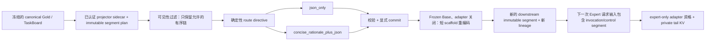

# 自然语言脚手架 producer 契约

[English](swebench_natural_language_scaffold.md)

## 状态、术语与规范范围

本文规定经过认证的 SWE-bench TaskBoard projector 下游自然语言脚手架
v1 producer 边界。“必须”“不得”“应当”“可以”均为规范性用语。producer
是确定性的低内存研究变换：它不调用模型或 provider，不训练 adapter，
不对 prompt 做 tokenization，也不修改 canonical Gold 或 held-out 数据。

架构名称是
`frozen-prefix Q-reader / prefix-branch producer-consumer`。在 v1 中，这一名称
表达接口与执行边界，不证明物理 cross-attention Q-reader 或 zero-copy KV
backend 已经实现。共享长前缀 prefill 期间，Planner/Base 的所有 expert
adapter 都必须关闭；只有经过校验的 route boundary 之后，expert adapter
才可能获得激活资格，而且只作用于 expert-private tail。

签入仓库的契约族如下：

| Artifact | 契约身份 |
| --- | --- |
| `configs/research/swebench_natural_language_scaffold_v1.yaml` | `anchor.natural-language-scaffold-config.v1` |
| `configs/research/swebench_natural_language_scaffold_sidecar.schema.json` | 记录 `anchor.natural-language-scaffold.v1` |
| `configs/research/swebench_natural_language_scaffold_manifest.schema.json` | `anchor.natural-language-scaffold-manifest.v1` |
| `configs/research/swebench_natural_language_scaffold_smoke_contract.schema.json` | `anchor.natural-language-scaffold-smoke-contract.v1` |
| `configs/research/swebench_natural_language_scaffold_smoke_v1.yaml` | 签入仓库、无授权效力的 smoke 实例 |
| `src/anchor_mvp/swebench/natural_language_scaffold.py` | `anchor.natural-language-scaffold-producer.v1` 实现 |

所有 schema 都是封闭 schema，只使用已认证的本地字节，不得解析远程引用。
最终 manifest 必须绑定每个 schema、配置、源 manifest、producer 核心实现与
输出文件的物理 SHA-256。核心模块使用 `producer.implementation_sha256` 绑定；
build/audit CLI 的文件哈希列入 Git 验收回报，并由同一 commit 追溯。本文不会重复
容易过期的哈希数值：`manifest.json` 与
强制 `manifest.json.sha256` 才是权威来源。后文收口流程规定如何从最终提交
字节重新计算这些值，并与最终回报逐项比较。

## 目标与明确非目标

v1 的目标是：

- 暴露简洁、可审计的决策接口，而不是隐藏推理；
- 将严格 route directive 绑定到 allowed evidence、约束、工具计划与验收条件；
- 同时产生 `json_only` 与 `concise_rationale_plus_json` 配对视图，以便做
  受控消融；
- 保留 bundle、角色、split、augmentation、语言、答案目标、证据与
  prefix lineage 的 provenance；
- 描述 route/commit/re-encode/next-request 边界，但不声称 runtime 已实现；
- 提供正文受限的 synthetic fixture 与无授权效力的本地行为 smoke contract，
  provider 请求数为零。

以下声明超出范围并被明确禁止：

- rationale 是私有/隐藏 CoT，或“无损继承”推理能力；
- expert 不生成 KV、attention 是 `O(1)`、Planner 休眠后 Base 计算消失，
  或整段 generation 精确共享同一份 KV；
- 普通 decoder 内部 Q-LoRA 足以证明全栈 exact KV reuse；
- 模型在同一请求中生成 sentinel 后可让 llama.cpp aLoRA 热切换；
- Planner-private KV tail 可作为 exact KV 直接交给 Expert；
- aLoRA 就是 cross-attention Q-reader、物理 shared KV、token-level MoE，
  或已经完成的 zero-copy 实现；
- Q4 GGUF 文件可以作为可训练 adapter/base 权重证据；
- synthetic fixture、server capability probe 或“内存可分配的上下文窗口”
  等同于质量、性能、安全、训练或 release 结果。

在普通 decoder 中，一层 attention 输出发生改变后，后续 hidden state 会变化，
后续层 K/V 也可能变化。因此 Q-only 是有价值的控制标签，也是部分设计的必要
条件，但不足以证明全层 KV 可以精确共享。

## 数据流与信任边界



canonical Gold 与封闭的 inner TaskBoard record 必须逐字节保持不变。
provenance 与 scaffold 元数据只存在于下游 outer sidecar。producer 在派生任何
内容前，必须认证 projector manifest、其 SHA sidecar、固定分区、每条原始
UTF-8 JSONL 行以及 segment plan。

必须先按 `task_bundle_sha256` split，再进行 clean/noisy 或 causal
augmentation。同一 task 的五个视图都留在同一 split，并与 inner
`training_record.task_board.task_id` 精确交叉绑定。五组 canonical
stage/expert 是 `planner/planner`、`tool_policy/tool_policy`、
`domain_builder/frontend_gen`、`domain_review/frontend_review` 和
`security/security_gate`。

在这条边界上，TaskBoard v2 的 source block ID 正式枚举恰好只有两种：canonical
block 使用 `tb-block-v1:<64-lowercase-hex>`，确定性的 stale noise overlay 使用
`tb-stale-v1:<64-lowercase-hex>`。两者都是 content-addressed identifier。record
schema 用两个互斥、完全锚定的 pattern 显式枚举它们；不得添加 generic prefix，
也不得由 consumer 本地特判。stale overlay ID 只能来自已认证 noisy augmentation
路径，并不扩大正文可见范围。

最小签入 fixture 确定性选择两个已认证 source bundle：一个
`train/noisy` bundle 与一个 `calibration/clean` bundle。每个 bundle 产生五个
角色、每个角色产生两种 scaffold variant，因此总计恰好 20 条记录。源端
`train/clean` 对仍要经过认证，并用于校验 augmentation 不变量；它不会被暗中
混入被选中的 noisy 视图。

| 输出文件 | 预期记录数 | 绑定的源 variant |
| --- | ---: | --- |
| `train/json_only.jsonl` | 5 | `noisy` |
| `train/concise_rationale_plus_json.jsonl` | 5 | `noisy` |
| `calibration/json_only.jsonl` | 5 | `clean` |
| `calibration/concise_rationale_plus_json.jsonl` | 5 | `clean` |

这个矩阵只是 contract fixture，不是正式数据集规模声明。calibration 绝不能
被描述成 held-out。

## 为什么必须“两请求 + 显式 commit”

llama.cpp 的 aLoRA invocation 扫描只检查新请求输入 token 序列中已有的
invocation tokens。它不会监视同一请求刚生成的 token，也不会在模型偶然输出
sentinel 时热加载 adapter。因此，v1 唯一允许的状态转移是：

1. Planner 请求：生成候选 concise rationale、route object、tool trace 与
   invocation/control sentinel；它们属于 private tail。
2. 校验：认证候选结构、evidence refs、policy hashes、route 与验收条件。
3. Commit：记录显式的文本/元数据提交。commit 不升级 Planner KV 字节，
   也不升级其 cache identity。
4. Re-encode：frozen Base 在所有 adapter 关闭的状态下处理这段已提交的短
   scaffold，生成新的 downstream immutable segment 与 lineage。
5. Expert 请求：把已提交 scaffold/control segment 放进下一次请求输入；
   只有这一次请求才可能在 invocation boundary 之后获得 expert adapter 资格。
6. Private tail：expert 生成自己的增量 KV；`full_generation_kv_shared` 仍为假。

Planner 生成属于 adapter-private 计算。其 hidden states、K/V、positions 与
adapter-dependent lineage 不等同于 frozen-Base encoding。文本相同不代表 KV
身份相同。因此，已提交 scaffold 在升级为 downstream immutable segment 前，
必须先经过 frozen-Base 短段重编码。未来真正的 cross-attention reader 可以
定义另一种机制，但 v1 没有实现也没有声称该机制。

机器可读的 aLoRA capability 必须固定：

- `activation_semantics=next_request_input_activation_only`；
- 只扫描下一次请求的输入；
- 必须先显式 commit；
- `same_request_activation_allowed=false`；
- `mid_request_generated_activation_allowed=false`；
- `mid_request_generated_trigger_switch_claimed=false`。

外层 `route_boundary.semantics` 必须是
`explicit_two_request_commit_boundary`；它与范围更窄的 aLoRA
`activation_semantics` 不是同一个字段。

## 记录契约与字段语义

每条记录都是封闭对象。精确约束以 JSON Schema 为准；下表只解释语义，
不会展示任何样本正文。

| 字段或字段组 | 语义与不变量 |
| --- | --- |
| `schema_version`, `record_id`, `pair_id` | 版本化记录身份。`pair_id` 只连接同一 role view 的两种 scaffold variant；ID 必须唯一且确定。 |
| `task_bundle_sha256`, `task_id_sha256`, `source_gold_sha256` | bundle、inner task ID 精确字节与冻结 source Gold 绑定。一个 bundle 不得映射到多个 task ID 或 split。 |
| `split`, `source_variant`, `stage`, `expert`, `language`, `scaffold_variant` | split/augmentation/角色/语言轴。scaffold variant 只能是 `json_only` 或 `concise_rationale_plus_json`。语言只继承，不得通过翻译擅自推断。 |
| `source_partition_sha256`, `source_line_sha256` | 认证物理 source partition 与原始行字节。不得用 parse 后的 canonical reserialization 伪造新的 source identity。 |
| `target_sha256`, `target_binding_sha256` | 无正文地绑定配对两条记录的同一答案目标；不输出 target/answer 文本。 |
| `allowed_evidence_sha256`, `forbidden_evidence_sha256` | canonical 元数据摘要，用来证明配对视图使用相同 evidence policy；它们不含 forbidden 文本。 |
| `segment_plan_sha256`, `ordered_segment_ids_sha256`, `terminal_prefix_lineage_sha256` | 精确 immutable plan、有序可见链与终端 lineage；禁止独立 block KV 任意拼接。 |
| `architecture_contract_sha256`, `adapter_control_policy_sha256`, `serialization_policy_sha256` | 绑定 frozen-prefix 架构边界、控制标签与 canonical renderer。 |
| `adapter_control_labels`, `training_outcome_claimed` | 固定有序的 `q_only`、`q_plus_o`、`wide_lora` 控制标签，并强制 producer 的训练结果声明为假。 |
| `route_boundary` | segment 级边界与状态转移；target tokenizer 未绑定时它不是 token offset。 |
| `cache_metadata` | shared-prefix/private-tail 范围、exact reuse 上限、identity 状态、重编码策略以及为假的物理/全程共享声明。 |
| `routing_json` | 严格的角色、目标、约束、allowed/evidence segment refs、工具计划与验收条件；它只引用已认证 ID/hash，不序列化整个 TaskBoard。 |
| `routing_json_sha256` | canonical UTF-8 `routing_json` 的 SHA-256；source object key 顺序改变时仍保持稳定。 |
| `tool_calls`, `tool_results` | 有序且 schema 受限的 sandbox trace。fixture 使用确定、无害的合成操作与结果，但不声称真实工具已经执行。 |
| `expert_trigger` | route boundary 后的短 expert 指令与 opaque invocation/control 文本绑定；tokenizer 未绑定前没有 token ID 或 token index。 |
| `alora_invocation` | 可选、capability-compatible 的两请求语义；永不授权 activation，也不声称 adapter 存在或已加载。 |
| `canonical_json_payload_sha256` | 两个配对视图共享的 canonical 结构化 payload SHA-256。 |
| `concise_rationale_summary` | 只存在于 `concise_rationale_plus_json`，在 `json_only` 中禁止出现；它是简洁、可审计的决策依据摘要，不是隐藏 CoT。 |
| `scaffold_text`, `scaffold_text_sha256` | 确定性 rendering 及其精确 UTF-8 摘要。`json_only` 只渲染 canonical JSON；plus 视图先放 concise rationale，再放完全相同的 canonical JSON payload。 |
| 状态/授权字段 | 必须保持 zero-request、not-evaluated、not-training、not-release 的事实；fixture 记录不能授权执行。 |

训练可见的结构化接口由四部分构成：

- `concise_rationale_summary`：短小、可检查的决策依据说明，只存在于 plus 视图；
- `routing_json`：严格 route/TaskBoard projection；
- `tool_calls` 与 `tool_results`：有序、可审计的 sandbox trace 元数据；
- `expert_trigger`：属于 route boundary 之后的短指令。

Q-only、Q+O 与 wide-LoRA 都只是实验控制标签，用于描述 consumer 分组。
producer 不得写入关于准确率、KV compatibility、速度或最佳 adapter 宽度的结论。

## Canonical hashing 与配对视图不变量

Canonical JSON 使用 UTF-8、对象 key 按字典序排列、无无意义空白、非 ASCII
字符不转义。所有哈希都基于精确 canonical bytes，不使用语言 runtime 的对象
hash。

`canonical_json_payload_sha256` 覆盖两种视图共同使用的严格结构化 payload：
在已绑定 serialization policy 下的 route、tool calls、tool results 与 expert
trigger。`scaffold_text_sha256` 覆盖精确 rendered bytes，因此两种 scaffold
variant 的该值不同。route JSON 只能由 allowlist 构造，并在哈希前 canonicalize，
所以输入对象 key 顺序变化不会改变其稳定哈希。

同一 `pair_id` 内，两条记录必须在 source bundle/task/Gold、split、source
variant、stage/expert、language、target binding、allowed/forbidden evidence
binding、segment plan 与 ordered lineage、route object、tool trace、trigger、
architecture/control/serialization policy 与 canonical JSON payload hash 上完全
一致。允许不同的只有 record identity、scaffold variant、concise rationale 是否
存在、rendered scaffold text 及其 hash。

producer 必须先确定 source/bundle split，再选择已认证 clean/noisy source view，
最后派生两种 scaffold variant。augmentation、language variant 或 role view 都
不得跨 bundle split。

## 可见性与正文排除

renderer 必须是 allowlist-only。它遍历 immutable ordered segment plan，且只能
序列化因果可见、角色允许的 segment refs；绝不能 stringify 整个 `task_board`、
wrapper、source row 或 attention-target object。

current target、future-stage 与 forbidden block 正文必须在 prompt 或 shared-prefix
rendering 之前被拒绝；禁止先插入再用 mask 隐藏。它们的正文、preview、answer、
token IDs 与 held-out material 不得出现在 record、manifest、log、exception 或
文档示例中。target 与 forbidden policy 可以只做 hash binding，不输出正文。
noisy overlay 属于 expert-private，不能改变五角色严格交集形成的 shared prefix。

Exact cache reuse 只适用于完全相同的 ordered prefix lineage，而且 token order、
positions、RoPE、tokenizer、model architecture 与 KV-producing weights 都必须相同。
v1 未绑定这些 runtime identity，因此 exact reuse 必须保持关闭，reuse savings
声明必须保持为零。

## Producer、consumer 与 runtime 的职责

| 层 | 负责 | 禁止 |
| --- | --- | --- |
| Producer | 认证 projector bytes；执行 split/role/visibility/pair 不变量；输出确定性 sidecar/manifest/scaffold 元数据；绑定 schema/config/source/implementation hash；原子发布 | 加载 llama.cpp 或模型；tokenize；调用 provider；选择训练赢家；修改 Gold/held-out；声称物理 KV reuse |
| Consumer / training materializer | 认证 producer manifest 与 SHA sidecar；选择配对消融视图；在独立派生 artifact 中绑定真实 tokenizer；保留 bundle split 与 target/evidence pairing；应用 Q-only/Q+O/wide-LoRA 控制标签 | 读取 forbidden/current/future 正文来“修复” scaffold；把 calibration 当 held-out；未绑定 tokenizer 就推断 token boundary；宽松接受未知版本 |
| Runtime | 绑定精确 model/tokenizer/RoPE/weights/adapter/server identity；校验 capability 与 committed route；以两个请求运行 Planner 和 Expert；用 frozen Base 重编码已提交短文本；维护 expert-private tail KV | 把 llama.cpp 状态耦合进 producer sidecar；由同请求生成 sentinel 切换；把 Planner-private KV 当 frozen-Base/expert KV 重用；把 metadata 当 zero-copy 证明 |

producer contract 与 runtime 解耦。llama.cpp 可以是某个 runtime consumer，
但 producer schema 中没有字段是 imperative llama.cpp API 调用，producer 是否有效
也不依赖 llama.cpp 是否存在。

## 可选 aLoRA 与本地 GGUF smoke 边界

可选 aLoRA capability 包含三个互相独立的证据域：

1. server protocol 是否支持扫描请求输入中的 invocation tokens；
2. 精确兼容的 adapter 是否存在、已加载并完成 identity binding；
3. 物理 Q-reader/zero-copy/shared-KV 行为是否成立。

第一个证据域不能满足第二或第三个。当前本地观察只覆盖 server capability
surface；fixture 中没有 aLoRA adapter，也没有物理 Q-reader 或 zero-copy 结果。

未来可以在 runtime 传入
可通过显式运行时路径提供名为 `qwen2.5-1.5b-instruct-q4_k_m.gguf` 的本地 artifact，做低成本 JSON/scaffold/
tool-trace 行为 smoke。提交的契约只标识 model artifact，不提交个人绝对路径；
文件大小与 SHA-256 在精确字节被认证前保持 runtime-required。fixture builder
加载的 model bytes 必须为零。Q4 GGUF 只属于 inference material，绝不是
trainable-weight 证据。

smoke contract 固定 `contract_scope=behavior_smoke_only`、provider/network 请求为
零、不训练、不晋级质量或能力、zero-copy/shared-KV/Q-reader 声明为假。未来 smoke
最多报告 parsing 与 schema-conformance 信号；它不能修改 producer manifest，
也不能授权蒸馏。

它的封闭顶层证据域是 `model_artifact`、`runtime_capability`、
`two_request_protocol`、`behavior_assertions`、`resource_limits`、
`current_execution` 与 `prohibited_claims`。分离这些证据域，可以防止外部观察到的
protocol capability 被误当成 model identity、adapter availability、已执行请求或
已经晋级的声明。

在真实 tokenizer identity、revision、asset hash、chat template、special-token
policy 与 serialization policy 全部绑定前，不得输出 token ID、invocation token
array、token offset、position 或 route-boundary token index。未绑定 token 字段
不能用 `0` 或 `null` 代替；它必须不存在。

## Fail-closed 条件与负向测试矩阵

任何失败都必须发生在原子发布前。部分输出目录不是有效 artifact。

| 范畴 | 必须拒绝的条件 | 必须产生的结果 |
| --- | --- | --- |
| 输入认证 | 缺少/损坏 `manifest.json.sha256`；物理 manifest/config/schema/partition SHA 或 byte count 不匹配 | 派生记录前拒绝 |
| 路径安全 | traversal、任一级 symlink/reparse point、output/input 重叠、output 已存在、output parent identity 改变 | 拒绝且不发布 |
| Snapshot/TOCTOU | 初次读取到最终发布检查期间 source bytes、size、device/file identity 或 manifest inventory 改变 | 整个 build 拒绝 |
| Schema | 未知版本、远程引用、额外字段、错误 scalar type、非法 UTF-8/JSON/JSONL、重复 record ID | 拒绝 |
| Bundle/split | bundle 映射到多个 task ID/split；五角色缺失、重复或跨 split；augmentation 早于 split | 拒绝 |
| Augmentation | train clean/noisy provenance 不配对；noisy 内容跨 task；calibration 冒充 held-out | 拒绝 |
| 可见性 | current target、future、forbidden 或 held-out 正文进入 allowed ref、renderer、scaffold、manifest、log 或 exception | 拒绝且不输出正文 |
| Segment chain | 顺序不连续、segment plan 被改、独立 KV 任意拼接、terminal lineage 不符 | 拒绝 |
| 配对视图 | 同一 `pair_id` 的 target/evidence/route/tool/trigger/policy hash 不同；rationale 出现在 `json_only` 或 plus 缺失 rationale | 拒绝 |
| Hashing | route payload 非 canonical、payload/rendered-text hash 不符、source-line identity 来自 reserialization | 拒绝 |
| Token boundary | tokenizer identity 未绑定却出现 token ID/index/offset/position | 拒绝 |
| Adapter/cache 声明 | prefix adapter 未关闭、boundary 后不是 expert-only、不要求 private-tail KV、full-generation sharing 为真、普通 Q-LoRA exact reuse 为真 | 拒绝 |
| aLoRA 转移 | 没有显式 commit；same-request 或 generated-mid-request activation 为真；activation 不是 `next_request_input_activation_only` | 拒绝 |
| Re-encode | Planner-private KV handoff/reuse 为真；frozen-Base adapter-disabled 为假；不要求新 downstream lineage | 拒绝 |
| Smoke 边界 | fixture 加载模型字节、把 Q4 当 trainable、声称 adapter loaded、quality passed、cross-attention Q-reader、zero-copy 或物理 shared KV | 拒绝 |
| 授权 | provider/network request 非零；training/evaluation/allocation/release authorization 为真 | 拒绝 |
| 发布 | output SHA/count 与 manifest 不符、缺 mandatory SHA sidecar 或最终 input recheck 不符 | 拒绝并清理未发布临时输出 |

负向回归应逐项独立变异每个不变量。只有隔离的 synthetic 测试输入可以使用
body sentinel；测试必须断言 sentinel 与 source body 都不会出现在产物或诊断字节中。

## 分阶段复现与资源边界

以下命令都在仓库根目录执行，并使用已安装仓库测试依赖的 Python 环境。
命令不会打印 JSONL 正文。

### 阶段 0：检查基线并校验契约

本轮变更基线是 `agent/restore-dual-router-ux` 分支的
`677bd2a689de7f904d808f35ec6d19adc73e6d2e`。

```powershell
git rev-parse HEAD
git status --short
python -m pytest tests/test_swebench_natural_language_scaffold.py -q
python -m ruff check src/anchor_mvp/swebench/natural_language_scaffold.py scripts/data/build_swebench_natural_language_scaffold.py scripts/data/audit_swebench_natural_language_scaffold_fixture.py tests/test_swebench_natural_language_scaffold.py
python -m py_compile src/anchor_mvp/swebench/natural_language_scaffold.py scripts/data/build_swebench_natural_language_scaffold.py scripts/data/audit_swebench_natural_language_scaffold_fixture.py
```

资源边界：模型加载为零、GPU 使用为零、provider/network 请求为零、不跑 full-bank
projection、不读取 held-out JSONL。

### 阶段 1：构建两次小型 synthetic fixture

使用已认证 projector fixture、其 mandatory manifest SHA sidecar 与两个全新输出
目录。输出已存在或与输入重叠时，builder 必须失败。

```powershell
$ScaffoldProjector = Resolve-Path ..\anchor-moe-lora-neural-swarm\fixtures\research\taskboard_projector
$ScaffoldManifestSha = ((Get-Content (Join-Path $ScaffoldProjector 'manifest.json.sha256') -Raw).Trim() -split '\s+')[0]
$ScaffoldOutA = 'tmp\natural-language-scaffold-repro-a'
$ScaffoldOutB = 'tmp\natural-language-scaffold-repro-b'
python scripts/data/build_swebench_natural_language_scaffold.py --config configs/research/swebench_natural_language_scaffold_v1.yaml --projector-dir $ScaffoldProjector --projector-manifest-sha256 $ScaffoldManifestSha --output-dir $ScaffoldOutA
python scripts/data/build_swebench_natural_language_scaffold.py --config configs/research/swebench_natural_language_scaffold_v1.yaml --projector-dir $ScaffoldProjector --projector-manifest-sha256 $ScaffoldManifestSha --output-dir $ScaffoldOutB
Get-FileHash (Join-Path $ScaffoldOutA 'manifest.json') -Algorithm SHA256
Get-FileHash (Join-Path $ScaffoldOutB 'manifest.json') -Algorithm SHA256
python scripts/data/audit_swebench_natural_language_scaffold_fixture.py --config configs/research/swebench_natural_language_scaffold_v1.yaml --artifact-dir $ScaffoldOutA --manifest-sha256 ((Get-FileHash (Join-Path $ScaffoldOutA 'manifest.json') -Algorithm SHA256).Hash.ToLowerInvariant())
```

两次 manifest hash 必须一致。测试会认证 mandatory sidecar、把 20 条记录校验为
四组各五条、检查 pairing 与正文排除，并断言 `provider_requests=0`。不得用命令
显示 JSONL 行。

签入 fixture 时，使用全新的
`fixtures/research/swebench_natural_language_scaffold` 空目录执行同一 build 命令。只有其
物理 manifest SHA 与 mandatory sidecar 相符，且 count matrix 与前表完全相同，
发布才有效。

### 阶段 2：不加载模型地校验 smoke contract

签入的 smoke YAML 只是元数据。即使本地 GGUF 不存在，schema/config 测试也必须
通过，因为物理 identity 是 runtime-required，而不是被伪造的值。fixture build
必须报告 model bytes loaded=0、request=0；本阶段不启动 llama.cpp server。

```powershell
python -m pytest tests/test_swebench_natural_language_scaffold.py -q -k "smoke or alora or two_request"
```

以后经 operator 明确批准的行为 smoke，可以绑定精确 local GGUF bytes 与指定的
llama.cpp build；它必须是独立 runtime artifact，使用小 context 与单记录预算，
并且不得重写 producer sidecar。当前没有兼容 aLoRA adapter，所以 activation
execution 保持 blocked。

### 阶段 3：tokenizer-bound 派生与 consumer 集成

本 producer 输出 segment boundary，不输出 token boundary。consumer 只有在认证
真实 tokenizer identity、revision、assets/runtime、chat template、special-token
policy、serialization policy、producer manifest 与 segment schema 后，才能派生
token positions。派生 inventory 必须是由所有这些 hash 共同寻址的独立 artifact。
在此之前，token-indexed aLoRA execution 必须 fail closed。

consumer 回归必须同时认证两种 scaffold variant，保持 target/evidence 不变，
保留 source-disjoint bundle split，并把 calibration 与 held-out 分开。本阶段不需要
provider 请求。

### 阶段 4：真实 provider 蒸馏仍是受 gate 控制的未来阶段

v1 故意不提供可执行的真实 provider 命令。只有以下全部 artifact 都存在且完成
hash binding 后，才可以增加该入口：

- frozen formal source snapshot 与 final release lock；
- source-disjoint train/calibration/held-out manifest，且本 producer 无法访问
  held-out 正文；
- 在 outer execution sidecar 中精确绑定 provider/model/prompt/template/policy
  identity；
- 显式 request、token、cost、retry、timeout、redaction 与 kill-switch budget；
- 从 dry-run 与至多一个请求开始、经过批准的 tiny pilot；
- 新的执行授权，不能复用本 fixture 中为假的 authorization 字段。

未来 CLI 契约必须暴露 `--dry-run`、显式 `--provider-request-budget` 以及 frozen
execution/release-lock hashes。dry-run 必须保持 zero-request。缺少任何 gate 时，
可复现结果应是拒绝，而不是隐式 provider 调用。full projection、大模型加载、
全量训练、创建 tag 与发布 release 均不属于本阶段。

## 版本、SHA 与迁移戒律

最终 build 与 Git 回报必须为下表每一项提供唯一、全小写的 SHA-256，且都从
最终提交的物理字节计算：

| 必须绑定的对象 | 权威位置 |
| --- | --- |
| config SHA | scaffold manifest 的 producer/config binding |
| record-sidecar schema SHA | scaffold manifest 的 schema binding |
| manifest schema SHA | scaffold manifest 的 schema binding |
| smoke schema 与 smoke YAML SHA | smoke contract inventory 与最终回报 |
| producer 核心实现 SHA | scaffold manifest 的 `producer.implementation_sha256` |
| build/audit CLI implementation SHA | 最终 Git 回报与 committed blob identity |
| source projector manifest/config/sidecar/segment schema 与 partition SHA | scaffold manifest input inventory |
| 四个输出文件 SHA/count | scaffold manifest file inventory |
| fixture `manifest.json` SHA | `manifest.json.sha256` 与最终回报 |
| committed-file Git blob identity | final commit 与 `git show --stat` |

必须重新计算，不得复制旧运行值：

```powershell
Get-FileHash configs/research/swebench_natural_language_scaffold_v1.yaml -Algorithm SHA256
Get-FileHash configs/research/swebench_natural_language_scaffold_sidecar.schema.json -Algorithm SHA256
Get-FileHash configs/research/swebench_natural_language_scaffold_manifest.schema.json -Algorithm SHA256
Get-FileHash configs/research/swebench_natural_language_scaffold_smoke_contract.schema.json -Algorithm SHA256
Get-FileHash configs/research/swebench_natural_language_scaffold_smoke_v1.yaml -Algorithm SHA256
Get-FileHash src/anchor_mvp/swebench/natural_language_scaffold.py -Algorithm SHA256
Get-FileHash fixtures/research/swebench_natural_language_scaffold/manifest.json -Algorithm SHA256
```

v1 artifact 是新增的下游产物；它不迁移或重写 canonical Gold、held-out、
TaskBoard v2、冻结 segment plan 或 long-context token inventory。consumer 必须
精确匹配 schema version 与物理 SHA，不存在宽松 v0/v1 coercion。未来不兼容
schema 必须以 v2 并行发布，并从同一份已认证 upstream bytes 重建。未来
token-bound boundary 是独立派生 artifact，不能原地修改 v1。

## Scoped Git 收口与可追溯性

本轮 producer 变更白名单只包括：

- 上文列出的五个
  `configs/research/swebench_natural_language_scaffold*` 契约文件；
- `src/anchor_mvp/swebench/natural_language_scaffold.py`；
- `scripts/data/build_swebench_natural_language_scaffold.py`；
- `scripts/data/audit_swebench_natural_language_scaffold_fixture.py`；
- `tests/test_swebench_natural_language_scaffold.py`；
- 本中英文两份 RFC；
- 如果更新 hash/count handoff，允许
  `docs/HANDOFF_DISTILLATION_20260720.md`；
- `fixtures/research/swebench_natural_language_scaffold/manifest.json`、mandatory
  `manifest.json.sha256` 与四个固定 JSONL 文件。

任何额外 audit helper 必须先在 staged-diff review 与最终回报中显式加入白名单。
其他 tracked modification 与未跟踪 training artifact 不得进入提交。本轮禁止使用
`git add .` 或 `git add -A`。

stage 前记录 `git status --short`，只 stage 精确白名单路径，然后执行：

```powershell
git diff --cached --name-only
git diff --cached --check
git diff --cached --stat
python -m pytest tests/test_swebench_natural_language_scaffold.py -q
python -m ruff check src/anchor_mvp/swebench/natural_language_scaffold.py scripts/data/build_swebench_natural_language_scaffold.py scripts/data/audit_swebench_natural_language_scaffold_fixture.py tests/test_swebench_natural_language_scaffold.py
python -m py_compile src/anchor_mvp/swebench/natural_language_scaffold.py scripts/data/build_swebench_natural_language_scaffold.py scripts/data/audit_swebench_natural_language_scaffold_fixture.py
```

必须把每个 staged 文件按 strict UTF-8 解析，拒绝超过 50 MiB 的文件，并在不
显示正文的情况下解析 staged structured files：

```powershell
$ScaffoldStaged = @(git diff --cached --name-only --diff-filter=ACMRT)
$ScaffoldUtf8 = [System.Text.UTF8Encoding]::new($false, $true)
$ScaffoldStaged | ForEach-Object { $ScaffoldBytes = [System.IO.File]::ReadAllBytes((Resolve-Path -LiteralPath $_)); $null = $ScaffoldUtf8.GetString($ScaffoldBytes); if ($ScaffoldBytes.LongLength -gt 52428800) { throw "scaffold_staged_file_too_large" } }
$ScaffoldStaged | Where-Object { $_ -like '*.json' } | python -c "import json,pathlib,sys; [json.loads(pathlib.Path(x.strip()).read_text(encoding='utf-8')) for x in sys.stdin if x.strip()]"
$ScaffoldStaged | Where-Object { $_ -like '*.jsonl' } | python -c "import json,pathlib,sys; ps=[pathlib.Path(x.strip()) for x in sys.stdin if x.strip()]; [json.loads(line) for p in ps for line in p.read_text(encoding='utf-8').splitlines() if line]"
$ScaffoldStaged | Where-Object { $_ -like '*.yaml' -or $_ -like '*.yml' } | python -c "import pathlib,sys,yaml; [yaml.safe_load(pathlib.Path(x.strip()).read_text(encoding='utf-8')) for x in sys.stdin if x.strip()]"
```

对 staged patch 运行仓库 credential/secret scanner 与个人路径扫描；二者都必须
没有发现。任何疑似 secret 的值都要进入人工审查，不得在 handoff 中打印。

```powershell
git diff --cached --no-ext-diff --unified=0 | rg -n '(?i)(BEGIN [A-Z ]*PRIVATE KEY|api[_-]?key\s*[:=]|access[_-]?token\s*[:=]|client[_-]?secret\s*[:=])'
git diff --cached --no-ext-diff --unified=0 | rg -n '(?i)([A-Z]:\\Users\\[^\\]+|/home/[^/]+)'
```

完整审查 staged patch，但 handoff 中不得打印样本正文。全部检查通过后才可以：

```powershell
git commit -m "feat: add natural-language scaffold producer contract"
git push origin agent/restore-dual-router-ux
$ScaffoldCommit = git rev-parse HEAD
$ScaffoldRemote = git ls-remote --heads origin agent/restore-dual-router-ux
$ScaffoldCommit
$ScaffoldRemote
git show --stat --oneline --decorate HEAD
git diff-tree --no-commit-id --name-only -r HEAD
```

commit SHA、local HEAD 与 remote branch head 必须完全一致。最终回报必须列出
精确 committed file list、物理 schema/config/implementation/fixture hash、
partition counts、test counts、复现命令与 `git show --stat` 摘要。任何不一致都
必须 fail closed。禁止创建 tag 或 release。

## 证据等级与真实未完成项

小 fixture 与回归通过后，v1 最多可以声称：

- 对 2 bundles × 5 roles × 2 scaffold variants 的确定性 contract construction；
- 已认证、正文受限的 visibility 与 paired-ablation 元数据；
- schema 层面的 two-request/commit/re-encode/next-request 语义；
- fixture build 期间 provider/model/GPU/network 活动均为零；
- 最终报告中测试所覆盖的物理 hash、count、TOCTOU、path 与 atomic-publication
  检查。

synthetic route、rationale summary 与 tool trace 只提供 shape/validation 的
proxy/smoke 信号。外部观察到的 llama.cpp invocation surface 只是 runtime
capability hint，不是 adapter execution 证据。

以下事项仍真实未完成，绝不能晋级声明：

- 真实 frozen formal-v3 snapshot 与 final release lock；
- 真实 provider 蒸馏与真实 sandbox tool trajectory；
- 精确 target tokenizer inventory 与 token route boundary；
- 兼容且经过认证的 aLoRA adapter，以及 next-request activation 实测；
- 物理 cross-attention Q-reader、zero-copy KV、CUDA/tensor backend，或 exact
  shared-KV correctness 证明；
- Q-only、Q+O、wide-LoRA 控制组的真实模型训练；
- long-context capability 与 quality validation、cache correctness、性能/内存
  测量以及质量/安全 A–F 评测；
- 独立成立的评测组与 formal release approval。

在这些 artifact 存在前，`formal_training_authorized=false`，runtime cache reuse
继续 fail closed，任何结果都不得从 metadata/fixture 或 proxy/smoke 晋级为
capability、quality、training 或 release 结论。
